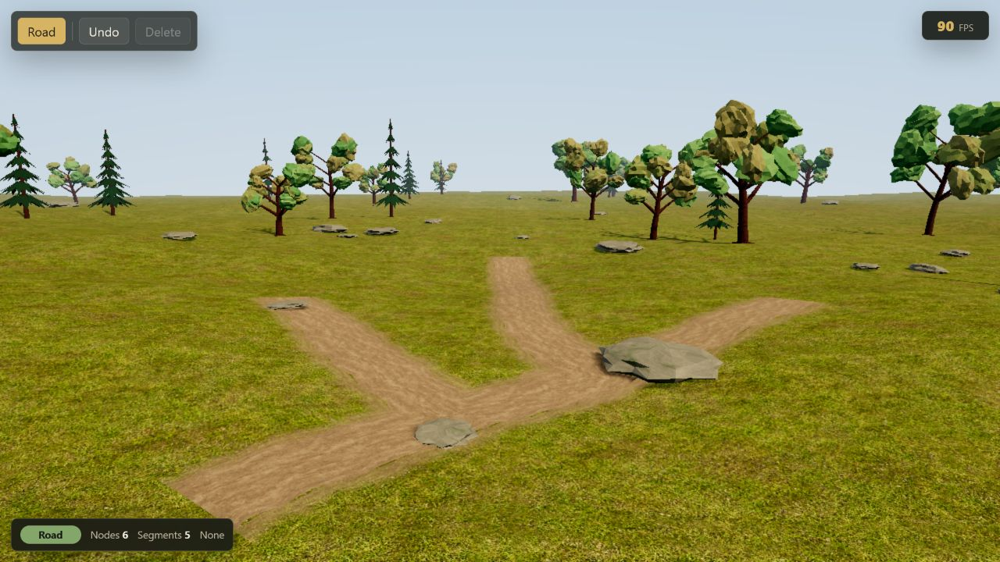

# Medieval Road System

A real-time Three.js sandbox for drawing medieval dirt roads directly onto a procedural 3D terrain. The project focuses on terrain-aware road placement, natural-looking road ribbons, junction generation, and lightweight builder controls for prototyping road networks in a game-like scene.



## Features

- Interactive road drawing on a 3D terrain heightfield.
- Terrain projection, so roads follow hills and ground variation.
- Snapping to existing road nodes and road segments.
- Automatic edge splitting when new roads connect to existing segments.
- Junction classification for endpoints, bends, T-junctions, cross-junctions, and complex junctions.
- Textured medieval dirt road materials with blended shoulders.
- Procedural terrain with grass, dead grass, dirt, and gravel tint blending.
- Low-poly trees, rocks, sky, lighting, fog, bloom, and color grading.
- Road selection, delete, undo, and live node/segment/FPS stats.
- Responsive full-screen canvas UI built with Vite, TypeScript, and Three.js.

## Controls

| Action | Control |
| --- | --- |
| Draw road | Left-click and drag on terrain |
| Select road | Click an existing road segment |
| Delete selected road | Delete button, `Delete`, or `Backspace` |
| Undo last road change | Undo button or `Ctrl+Z` / `Cmd+Z` |
| Cancel active road preview | `Escape` |
| Pan camera | Right-click drag, `WASD`, or arrow keys |
| Rotate camera | Middle-click drag or `Q` / `E` |
| Zoom camera | Mouse wheel |

## Quick Start

Install dependencies:

```bash
npm install
```

Run the development server:

```bash
npm run dev
```

Open the local URL printed by Vite, usually:

```text
http://localhost:5173/
```

Create a production build:

```bash
npm run build
```

Preview the production build:

```bash
npm run preview
```

## Project Structure

```text
src/
  app/        App bootstrap and frame loop
  camera/     Orbit-style camera movement and bounds
  input/      Keyboard and pointer state helpers
  props/      Trees, rocks, and scene props
  roads/      Road graph, drawing tool, mesh generation, materials, previews
  scene/      Three.js scene, renderer, lighting, sky, post-processing
  sky/        Animated sky/cloud mesh
  terrain/    Procedural heightfield and ray projection
  ui/         Build toolbar and runtime stats
  utils/      Three.js disposal helpers
public/
  assets/     Terrain, road, prop, and third-party texture assets
scripts/
  derive_pbr_maps.py  Utility script for derived texture maps
docs/
  screenshots/ Project screenshots used by this README
```

## How It Works

The terrain is generated as a continuous heightfield in `src/terrain/Terrain.ts`. It combines several value-noise layers with broad sine/cosine shaping, then uses vertex colors to blend terrain tints over tiled texture maps.

Road placement is handled by `src/roads/RoadTool.ts`. Pointer input is projected onto the terrain by `TerrainProjector`, sampled as the user drags, validated against slope and minimum length rules, and committed into a `RoadNetwork`.

`src/roads/RoadNetwork.ts` stores roads as nodes and edges. It resolves endpoint snapping, splits existing road segments when new paths connect into them, detects crossings, prunes orphan nodes, and classifies junction types.

`src/roads/RoadMeshBuilder.ts` turns road graph edges into terrain-following ribbon meshes. It samples Catmull-Rom curves, builds a core dirt ribbon, adds irregular blended shoulders, and keeps the road slightly above the terrain to avoid z-fighting.

`src/scene/SceneManager.ts` owns the Three.js renderer, camera, terrain, sky, props, road groups, selection/preview groups, lighting, fog, bloom, and color grade pass.

## Tech Stack

- TypeScript
- Vite
- Three.js
- WebGL renderer with ACES tone mapping, shadows, bloom, fog, and custom shader color grading

## Assets

Texture assets are stored under `public/assets/textures`. The road surface uses a medieval dirt texture set with albedo, normal, roughness, ambient occlusion, height, rut mask, and edge mask maps. Terrain and prop textures are loaded locally as well, so the app does not need a backend or external asset service at runtime.

## Development Notes

- The app is client-only and can be hosted as a static build.
- `npm run build` runs TypeScript first, then Vite's production build.
- A Vite chunk-size warning may appear because Three.js and post-processing code are bundled into the main client chunk. The build still completes successfully.
- `dist/`, `node_modules/`, logs, and local editor files are ignored by Git.

