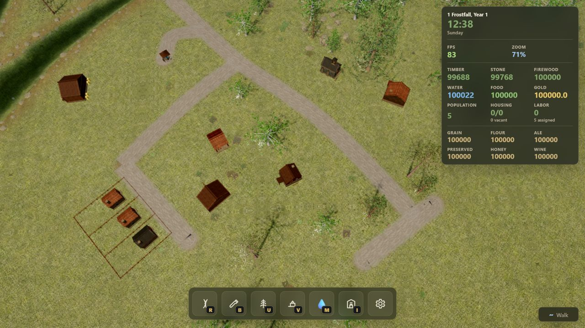

# Medieval Settlement — Three.js

A real-time Three.js sandbox for growing a **medieval settlement** on a procedural 3D landscape. On a fresh game, choose map size, topography, hydrology, forest density, and world seed before generation begins. Draw dirt road networks across rolling hills, pine forests, and winding rivers — wooden bridges and graded ramps appear automatically when a path crosses water. Place production buildings to harvest timber, stone, game, and berries; connect wells and woodcutter's lodges along those roads; then lay out residence zones along your roads so settlers move in over time. Homes need firewood, water, and food — road-based delivery crews haul supplies from lodges, wells, hunter's halls, and forager's sheds while you watch wooden carts travel the network. Assign workers from your labor pool, plant backyard gardens for local food and village gold, and keep the supply chain running before homes are abandoned. A [SpacetimeDB](https://spacetimedb.com/) Rust module runs the authoritative economy simulation; the client renders replicated state in real time. Toggle the hydrology overlay to scout well sites, inspect foraging nodes and quarries from map icons, and drop into first-person walk mode to explore on foot.



## Setting & visual direction

**Gorski Kotar, Croatia — circa 1500–1600.** The default sandbox is a wet, wooded highland in the Dinaric Alps: beech–fir valleys, karst ridges, limestone hamlets, and seasonal trade with Kvarner. Regional market goods, forest species, and building materials all lean into that slice of Croatian history. You are free to retarget the game to another region or era — treat this as a starting point, not a hard constraint.

**Build menu cards** use a **Croatian naive art** style — folk painting with flat color, bold outlines, and charming asymmetry. Examples live in `public/assets/ui/build-menu/`.

**3D buildings and residences** follow the shared [building visual language](docs/design/building-visual-language.md): grounded Gorski vernacular, limestone-and-timber construction, and silhouettes readable at settlement zoom. The chapel mesh is the reference implementation.

**Generating new assets?** Before asking an LLM or agent to create buildings, menu illustrations, or textures, point it at `docs/design/building-visual-language.md` and the existing art under `public/assets/` so output stays consistent. To shift the whole aesthetic — different country, period, or illustration style — update that document first (or ask your agent orchestrator to do that), then regenerate art and meshes against the new brief.

## Features

### Road building

- Interactive point-by-point road drawing projected onto a 3D terrain heightfield.
- Terrain projection so roads follow hills, slopes, and ground variation.
- Snapping to existing road nodes and road segments.
- Automatic edge splitting when new roads connect to existing segments.
- Wheel-adjusted curvature per segment (`Ctrl + scroll`), merged with automatic curve suggestions that route around building and residence footprints.
- Junction classification for endpoints, bends, T-junctions, cross-junctions, and complex junctions.
- Junction and endpoint cap meshes that blend road ribbons into clean intersections.
- Textured medieval dirt road materials with irregular blended shoulders.
- Live road preview while drawing, plus selection and delete with confirmation popup.
- Undo last placed point, undo last committed change, redo (`Ctrl+Y`), and full draft cancel.
- Terrain road-wear blending that tints grass to packed dirt along committed road corridors.
- Automatic river bridge generation when a road crosses water — graded approach ramps, elevated deck, and instanced support posts.
- Wood-log bridge deck material blended onto the road ribbon via a per-vertex `bridgeBlend` attribute.
- Bridge preview tint while drawing, plus placement validation that rejects spans wider than the max bridge length.
- Rock collision checks that block roads through scattered forest and river-shore boulders.
- Road-network connectivity for gameplay — buildings and residences must be within road-path distance for access, mill→lodge timber routing, and lodge/well/food-supplier delivery.

### Economy & settlement

- **Settlement HUD** — per-player timber, stone, firewood, water, food, gold, population, housing (occupied/capacity/vacant), free labor, in-game date/time, and live FPS and zoom readout.
- **Cheat mode** — open the game menu, choose any amount up to one billion, and top up every treasury resource for unrestricted city planning and screenshot builds.
- **Shared game balance** — one `balance/gameBalance.json` source generates Rust constants and TypeScript bindings for costs, radii, tick intervals, and production rates.
- **Construction logistics** — placing a production, storage, service, faith, or trade building creates a cleared construction site, automatically assigns up to four available builders, and reserves its timber/stone cost without teleporting stock. Unassigned villagers can fetch reserved materials from any completed, reachable building, so already-produced stock never requires source staffing. Staffed storehouses remain the preferred dispatch points and send substantially larger, faster batches. Recognizable timber/stone carts unload into the intended site, builders advance only as far as delivered materials allow, and the founding treasury remains a paced bootstrap reserve for the first supply chain.
- **Staged construction sites** — foundations, stone courses, timber frames, scaffolding, cut-log piles, and quarried-stone piles update as deliveries and builder work progress. The inspector shows delivered, reserved, in-transit, road access, and builder status. Roads/bridges, backyard structures, site clearing, and demolition remain instant.
- **Building storage** — the village storehouse centralizes timber, stone, and firewood and provides much larger construction-cart batches when staffed; its capacity and stored stock remain useful without assigned labor. Mills, lodges, quarries, wells, granaries, and processors retain specialized capped inventories. Construction spending protects reserved stock from trade and other orders until it is delivered or the site is cancelled.
- **Salvage on demolish** — removing buildings, residence zones, or backyard gardens refunds a fraction of placement cost plus stored resources.
- **Labor assignment** — assign workers to production buildings via the inspector; labor speeds harvest cycles and is capped by available population.
- **Population & housing** — starting population plus occupants from placed residences; settlers arrive gradually per home; unassigned workers form the free-labor pool.
- **Treasury gold** — backyard gardens linked to a marketplace generate village trade; earnings split between **household wealth** (saved per home, capped) and **mayor tax** (Laffer productivity curve). A staffed **chapel** on the road collects flat tithes from household savings when villagers attend.
- **Lumber mill** — harvests the nearest mature tree within a 210 m work extent when road-connected to a well; stores timber and consumes water per harvest; up to 3 laborers scale the 9 s harvest cycle.
- **Reforester** — regrows stumps within a 190 m radius through `stump → growing → mature` phases; growing trees render as animated saplings; up to 1 laborer.
- **Stonecutter's camp** — extracts stone from the nearest procedural quarry site within 55 m every 9 s until depleted; stores stone in the building; up to 4 laborers.
- **Woodcutter's lodge** — processes stored timber into firewood on a 5 s cycle, pulls timber from road-connected mills, and dispatches delivery crews along the road network; up to 2 laborers split between processing and delivery.
- **Well** — refills groundwater based on local hydrology score, with occasional surges; delivers water to claimed residences along connected roads; capacity and yield depend on placement; up to 2 laborers split between pumping and delivery.
- **Hunter's hall** — hunts game from procedural foraging nodes within 68 m, stores food, and delivers along roads; up to 3 laborers.
- **Forager's shed** — gathers berries from forest-edge foraging nodes within 48 m, stores food, and delivers along roads; up to 2 laborers.
- **Chapel** — parish hub on the road; assign a priest to collect tithes from road-linked household wealth into the **parish coffer** (collect into treasury when ready); boosts settlement, shortage resilience, and abandoned-home recovery. Optional Sunday sabbath observance (requires staffed chapel) pauses labor and logistics that day.
- **Pauline monastery** — mid-game hillside landmark (requires staffed chapel and 12+ population); road-linked to the parish for full strength. Autonomous grain→food production, pilgrimage gold via marketplace, feast-day charity, ongoing food deliveries within a 520 m coverage radius, and wider faith bonuses for road-linked homes inside that radius. City administration sets tithe share (0–80%) and feast-day charity.
- **Marketplace** — village trade hub on the road; buy and sell timber, stone, firewood, and food for gold, or barter goods. Backyard garden surplus and mayor tax both flow through marketplace-linked homes.
- **Expanded agriculture & processing** — grain fields and threshing barns; fields have no hard area cap, with full per-square-metre efficiency through 1,600 m² and soft diminishing returns beyond it; river **watermill** (shore placement); **granary** bakes flour into food; **brewery** and **smokehouse** supply ale and preserved food for tier-2/3 homes; **apiary** and **vineyard** for honey/wine exports.
- **Carpenter & wheelwright** — reduces timber placement cost when road-linked; **ferry landing** (shore placement) earns trade income when staffed and marketplace-connected.
- **Road-based logistics** — Dijkstra road-path distance routes timber mill→lodge, firewood lodge→residence, water well→residence, and food supplier→residence; nearest supplier claims each home on its road branch.
- **Delivery trips** — server-spawned road agents travel outbound, unload at the residence, and return; client renders worker-hauled wooden carts with recognizable commodity loads such as bundled firewood, water barrels, food baskets, sacks, kegs, amphorae, timber poles, and quarried stone.
- **Foraging nodes** — procedural game trails and berry patches bootstrapped at world start; depleted nodes respawn at new locations after cooldowns.
- **Tree lifecycle** — server-driven `mature → stump → growing → mature` phases with client visual sync (instanced forest, animated saplings, stumps).
- Server-authoritative simulation tick (200 ms) in the Rust module — buildings, trees, quarries, foraging, delivery trips, residence needs, backyard gardens, and settlement growth all run server-side. No pause or speed controls; players live through time at a fixed rate.
- **In-game calendar** — one real second equals one sim second; a full day is 24 hours. Twelve 30-day months (no leap years), weekday names, and work hours 06:00–20:00. The settlement HUD shows date and time. Outside work hours, assigned labor pauses, residence needs do not deplete, chimneys go quiet, and the world shifts through dawn/day/dusk/night lighting. With a staffed chapel, the mayor can enable **Sunday sabbath** in City administration — labor, deliveries, need consumption, and tithes pause that day in exchange for higher chapel attendance and faster settlement.
- Construction dock UI — `R` for roads, `B` for settlement essentials (residences, well, chapel, monastery, marketplace, ferry), `V` for industry and provisioning (grain chain, food processing, forestry, extraction, carpenter, apiary, vineyard), `M` for the hydrology overlay. **City administration** (main menu → gear) sets mayor tax, parish coffer policy, and Pauline monastery tithe share / feast-day charity.
- Building placement tool with terrain-following preview, flattened terrain pads, functional extent overlays for spatial buildings, and validation (water, slope, overlap, trees, quarry stone, and foraging nodes). Buildings may be constructed without road access; roads are connected afterward to enable transport, services, and other network-dependent bonuses.
- Building and residence demolish actions from the inspector panel.
- Click-to-inspect resource panel for quarries, foraging nodes, buildings, residences, backyards, and river access — yields, storage, labor controls, runway days, delivery status, and hydrology grades.
- Map icons at zoomed-out camera levels for quarries, foraging nodes, and backyard gardens; click an icon to inspect the site.

### Residences

- **Residence zone placement** — click two points along a road for the frontage edge, then a third point behind the road to set backyard depth; the plot subdivides into residence parcels.
- **Residence layout HUD** — adjust plot count (+/−), rotate frontage edge (`F`), and see validity while placing.
- **Road frontage requirement** — zones must sit within frontage distance of the road network; parcels face the selected frontage edge.
- **Per-parcel costs** — each residence costs timber and stone on placement; narrow and wide parcels get 2 or 4 population capacity respectively (default 3). Homes can upgrade to **tier 2** (preserved food) and **tier 3** (ale) when road-linked processing buildings are available.
- **Gradual settlement** — empty homes fill one settler at a time after a settle timer; inspector shows pending settlers and ETA.
- **Procedural residence meshes** — timber-and-stone houses with varied facade and roof colors per parcel; instanced fence posts and rails along zone boundaries.
- **Residence needs** — residents consume firewood, water, and food per person per tick; homes track per-need stock and deficit timers server-side.
- **Abandonment & recovery** — prolonged shortage of any need abandons a residence (population drops to zero); homes can recover once all needs are restocked and road-connected suppliers are available.
- **Backyard gardens** — click an occupied home's backyard to plant apple/cherry orchards, vegetable gardens, flower beds, or herb plots; food gardens partially self-supply the household; surplus and ornamental gardens sell at a road-linked marketplace — after-tax profit builds **household wealth**, while the mayor's tax flows to treasury. Planted gardens render as small 3D plots behind each home.
- **Household economy** — each occupied home tracks saved gold (`household_wealth`, capped); residence and backyard inspectors show wealth, savings rate, and parish tithe exposure; City administration summarizes village wealth, mayor tax, and chapel tithe income.
- **Residence inspector** — firewood/water/food stock, runway days, household wealth, serving lodge/well/food supplier, chapel link, road access, settlers pending, and demolish options for a single home or entire zone.

### Exploration

- First-person walk mode with pointer-lock mouse look, spawned from the current orbit camera position.
- Terrain-following locomotion with sprint, jump, crouch toggle, and head-bob camera motion.
- Free-look while holding `Alt` — look around without turning the body; view recenters on release.
- Scrolling compass HUD with cardinal and intercardinal labels while walking.
- Seamless handoff between RTS orbit camera and walk mode via `~` (backtick).
- Walk locomotion samples road deck height so you can traverse built roads and bridges on foot.

### Landscape & environment

- **World setup** — on first launch (or via game menu → **New world…**), pick map size (Small / Medium / Large), topography roughness, hydrology intensity, forest density, and a reproducible world seed before the terrain generates.
- Large procedural heightfield terrain with multi-layer value noise and broad macro shaping.
- TSL grass-blend terrain material mixing meadow, dense, and dry grass PBR texture sets.
- River-carved valleys with muddy shore blending where water meets land.
- Procedural river layout with multiple source corridors, tributaries, and a central confluence drain.
- Animated river water using a 2D virtual-pipes simulation with foam, shore lap, and alpha feathering.
- Organic river shore SDF fields for natural bank shapes and terrain mud tinting.
- Scatter-placed river shore stones along bank edges, with procedural shore-crossing gaps that clear stones for natural ford points.
- Instanced conifer forest with narrow, broad, and young tree forms plus scattered rocks and outcrops.
- Forest undergrowth — instanced bushes and ferns scattered in dense woodland pockets.
- Streamed 3D grass blade tufts with camera-relative LOD, zoom-gated reveal, and road clearance.
- Road-edge tree stumps placed along committed road corridors after tree clearance.
- River shore reeds clustered along bank edges for added shoreline detail.
- Trees automatically cleared along built roads; props respect river blocking zones.
- Procedural rock quarries (one large, two small) carved into the terrain with pit depressions, scattered boulders, and grass clearance pads.
- Procedural foraging nodes — game trails in woodland and berry patches near forest edges.
- **Hydrology overlay** — toggle a groundwater map (`M`) to grade well placement sites before building.
- Animated volumetric-style sky and cloud dome with wind-driven motion.
- Directional sun lighting, exponential fog, soft shadow maps, and shadow bounds fitting.
- Ambient audio — wind and village ambience that intensifies when the camera nears your settlement.

### Rendering & UI

- WebGPU renderer preferred with automatic WebGL fallback.
- Dual post-processing pipeline: WebGL bloom + color grade, or WebGPU TSL bloom + daylight grade.
- Progressive loading screen with staged status labels while the world initializes.
- Contextual tip cards for camera, walk, and road modes — toggle off via the game menu.
- Game menu with persistent "turn off tips" preference stored in `localStorage`.
- Toast notifications for rejected road, building, and residence placements (steep slope, river too wide, rocks in the way, insufficient resources, missing foraging, etc.).
- Construction dock and build menu with illustrated cards, hotkeys, settlement HUD, compass strip, residence layout HUD, delivery-agent rendering, and building cost hints.
- Responsive full-screen canvas built with Vite, TypeScript, and Three.js r185.

## Controls

| Action | Control |
| --- | --- |
| Toggle road tool | `R` or click **Roads** in the construction dock |
| Open build menu (settlement essentials) | `B` or click **Build** in the construction dock |
| Open industry menu (production & trade) | `V` or click **Industry** in the construction dock |
| Toggle hydrology / water map | `M` or click **Water map** in the construction dock |
| Place road point | Left-click on terrain |
| Undo last placed point while drawing | Right-click |
| Curve the road | Hold `Ctrl` and scroll the mouse wheel |
| Commit / build the road | Click the hammer icon or press `Enter` |
| Delete road segment | In road mode, hold `Alt` and left-click a segment |
| Confirm deletion | Click **Remove** in the popup |
| Undo last road change | `Ctrl+Z` / `Cmd+Z` |
| Redo last road change | `Ctrl+Y` / `Cmd+Y` |
| Cancel active road preview | `Escape` (road mode) |
| Select residence | Build menu (`B`) → **Residence** (`H`) |
| Select well | Build menu (`B`) → **Well** (`E`) |
| Select chapel | Build menu (`B`) → **Chapel** (`C`) |
| Select Pauline monastery | Build menu (`B`) → **Pauline monastery** (`O`) |
| Lay out a grain field | Select a **Farmstead** → **Lay out farm field** |
| Fence pasture or pannage | Select a **Pastoral farmstead** or **Woodland swineherd** → pasture action |
| Select brewhouse | Industry menu (`V`) → **Brewhouse** (`B`) |
| Select lumber mill | Industry menu (`V`) → **Lumber mill** (`L`) |
| Select stonecutter's camp | Industry menu (`V`) → **Stonecutter's camp** (`S`) |
| Select reforester | Industry menu (`V`) → **Reforester** (`F`) |
| Select woodcutter's lodge | Industry menu (`V`) → **Woodcutter's lodge** (`W`) |
| Select hunter's hall | Industry menu (`V`) → **Hunter's hall** (`K`) |
| Select forager's shed | Industry menu (`V`) → **Forager's shed** (`Y`) |
| Select marketplace | Build menu (`B`) → **Marketplace** (`P`) |
| Open city administration | Main menu (gear) → **City administration…** (tax, parish coffer, monastery policy) |
| Enable / top up cheat resources | Main menu (gear) → **Cheat mode** → enter an amount → **Enable cheat mode** |
| Place building | Left-click on terrain (building tool active) |
| Undo last building placement | `Ctrl+Z` / `Cmd+Z` |
| Redo last building placement | `Ctrl+Y` / `Cmd+Y` |
| Place residence zone | Click frontage start on road, frontage end on road, then depth behind road |
| Undo last residence placement | `Ctrl+Z` / `Cmd+Z` |
| Redo last residence placement | `Ctrl+Y` / `Cmd+Y` |
| Adjust residence plot count | `+` / `−` buttons in the residence layout HUD |
| Rotate residence frontage edge | `F` or click the frontage button in the residence layout HUD |
| Inspect quarry / foraging / building / residence / backyard / river | Left-click on terrain (no tool active) |
| Plant or manage backyard garden | Inspect an occupied residence backyard |
| Assign labor to building | Inspector panel → labor `+` / `−` |
| Demolish building, garden, or residence | Inspector panel → **Remove** |
| Pan camera | Right-click drag, `WASD`, or arrow keys |
| Rotate camera | Middle-click drag or `Q` / `E` |
| Zoom camera | Mouse wheel |
| Toggle walk mode | Backtick (`~`) |
| Move (walk mode) | `WASD` or arrow keys |
| Sprint | `Shift` |
| Jump | `Space` |
| Crouch toggle | `C` |
| Free look (walk mode) | Hold `Alt` |
| Exit walk mode | `Escape` (walk mode) |
| Open game menu | Click the menu button (top-left) or `Escape` (RTS mode) |
| Start a new world | Game menu → **New world…** (resets the server database when connected; always clears local settings and player identity) |

## Quick Start

Install dependencies:

```bash
npm install
```

Run the development server (roads only — buildings and residences require SpacetimeDB):

```bash
npm run dev
```

Open the local URL printed by Vite, usually:

```text
http://localhost:5173/
```

Create a production build:

```bash
npm run build
```

Preview the production build:

```bash
npm run preview
```

## SpacetimeDB (authoritative backend)

This project uses [SpacetimeDB 2.0.1](https://spacetimedb.com/) for authoritative game state: treasury, buildings, trees, quarries, foraging nodes, roads, residence zones, backyard gardens, delivery trips, and the full settlement supply chain. The client is a thin renderer — all economy simulation runs in the Rust module via a scheduled `tick_sim` reducer every 200 ms.

### Run locally

1. Start the SpacetimeDB standalone server (once per machine):

```bash
spacetime start
```

2. Publish the Rust module and regenerate TypeScript bindings:

```bash
npm run deploy:local
```

This runs `generate:world-bootstrap` (tree and foraging layout data for server bootstrap), `generate:game-balance` (shared economy constants), publishes the module to database `city-builder`, and writes TypeScript bindings to `src/generated/`.

To wipe and republish from scratch:

```bash
npm run deploy:local-clean
```

3. Start the Vite dev server:

```bash
npm run dev
```

The client connects to `http://localhost:3000` with database name `city-builder`.

### Anonymous identity

No login is required for local dev. On first connect SpacetimeDB issues a signed JWT; the client stores that token in `localStorage` (keyed by database name) and reconnects with the same player identity on refresh. Treasury, buildings, roads, and residences are scoped to that identity.

When real auth is added later, swap the token source in `src/network/identityPersistence.ts` — the connection layer stays the same.

### What syncs through the DB

| Data | Server table | Notes |
| --- | --- | --- |
| Timber / stone / firewood / water / food / gold / grain / flour / ale / preserved food / honey / wine | `player_resources` | Per anonymous identity (treasury); parish and monastery policy fields on same row |
| 20 building kinds (mills, lodges, quarry, well, food, chapel, monastery, marketplace, grain chain, processing, apiary, vineyard, carpenter, ferry) | `building` | Per-building storage, labor, cooldowns; server tick drives production |
| Tree stump / growing / mature | `tree_entity` | Bootstrapped after forest load |
| Quarry remaining yield | `quarry` | Global world sites (1 large + 2 small) |
| Game trails / berry patches | `foraging_node` | Depletes on harvest; respawns after cooldown |
| Roads + bridges | `road_network_state` | Full `RoadNetworkSnapshot` JSON per player |
| Residence zone layout | zone records | Rectangular plot corners, frontage edge, plot count |
| Residence parcels | `residence` | Population, capacity, settlement ticks, abandoned flag |
| Residence need stocks | `residence_need` | Firewood, water, food, preserved food, ale — stock + deficit timers (tier-gated) |
| Backyard gardens | `backyard_garden` | Orchard, vegetable, flower, or herb plot per residence |
| Active delivery hauls | `delivery_trip` | Road agents carrying firewood, water, or food |
| Sim tick counter | `world_config` | Monotonic server tick |
| World generation | `world_config` | Authoritative seed, map size, topography, hydrology, forest density (`configure_world` on connect) |

**Player reducers:** `place_building`, `demolish_building`, `assign_building_labor`, `collect_chapel_coffer`, `marketplace_trade`, `set_economic_activity_tax_rate`, `set_chapel_parish_policy`, `set_monastery_policy`, `reset_world`, `configure_world`, `place_backyard_garden`, `demolish_backyard_garden`, `sync_road_network`, `remove_road_edge`, plus place/demolish/upgrade residence zone. **Bootstrap reducers:** `bootstrap_quarries`, `bootstrap_trees`, `bootstrap_foraging`.

### Server connection required

Medieval Settlement is **not playable without a live SpacetimeDB connection**. The client renders replicated server state; it does not queue roads, buildings, or economy actions offline.

- **Boot** — the loading screen stays up until SpacetimeDB connects, subscribes, and world bootstrap completes. If the server is down, you get a retry screen instead of partial gameplay.
- **Mid-session disconnect** — all construction tools are disabled and a reconnect overlay appears with automatic retry.
- **New world** — requires a live connection; `reset_world` must succeed on the server before local settings and identity are cleared.

See `docs/design/server-authoritative-connection.md` for the full connection model.

## Project Structure

```text
src/
  app/        App bootstrap and frame loop
  audio/      Ambient wind and village audio driven by camera proximity
  buildings/  Building placement tool, meshes, markers, terrain pads, and validation
  camera/     RTS orbit camera, first-person controller, and locomotion helpers
  data/       SpacetimeDB game store (replicated state)
  foraging/   Foraging node layout helpers and yield display
  generated/  SpacetimeDB TypeScript bindings and game-balance constants (auto-generated)
  grass/      Streamed 3D grass blade field and zoom LOD math
  hydrology/  Groundwater sampling, well capacity math, and hydrology overlay
  input/      Keyboard and pointer state helpers
  logistics/  Client-side runway, delivery trip, firewood/water/food routing helpers
  map/        Screen-projected quarry, foraging, and backyard map icons
  network/    SpacetimeDB client + anonymous identity persistence
  placement/  Spatial index for building, residence, and road footprint conflicts
  props/      Instanced forest, undergrowth, stumps, rocks, road clearance, shadow filters
  quarries/   Quarry site layout, terrain depression, and rock scatter
  residences/ Residence zone tool, layout, meshes, fencing, backyard gardens, and placement validation
  resources/  Game state, tree registry, world layout, resource inspector
  rivers/     River layout, field sampling, water sim, banks, reeds, and shore stones
  roads/      Road graph, drawing tool, mesh generation, junctions, bridges, connectivity
  runtime/    GameRuntime bridge (SpacetimeDB → App)
  scene/      Three.js scene, renderer backend, lighting, post-processing, hydrology overlay
  sky/        Animated sky/cloud mesh
  terrain/    Procedural heightfield, grass materials, road wear, ray projection
  ui/         Construction dock, build menu, compass HUD, game menu, tip cards, toasts, loading screen
  utils/      Path geometry helpers, random utilities, and Three.js disposal
  world/      Precomputed world bootstrap data (tree and foraging positions for server seed)
balance/      Shared game-balance JSON (costs, radii, production, population, gardens)
server/       SpacetimeDB Rust module (authoritative sim tick, economy, logistics)
public/
  assets/     Terrain, road, prop, UI build-menu art, and third-party texture assets
scripts/
  derive_pbr_maps.py             Utility script for derived texture maps
  generate_wood_logs_texture.py  Procedural wood-log bridge albedo generator
  generateWorldBootstrap.mts     Generates tree and foraging bootstrap JSON for server publish
  generateGameBalance.mts         Generates Rust + TypeScript balance constants
  testLodgeLogistics.mts         Standalone firewood delivery logic validation
docs/
  design/     Connection model, visual language, and design decisions
  screenshots/ Project screenshots used by this README
```

All new building and residence models must follow the canonical [building visual language](docs/design/building-visual-language.md). The custom chapel mesh is its reference implementation.

## How It Works

The terrain is generated as a continuous heightfield in `src/terrain/Terrain.ts`. It combines several value-noise layers with broad sine/cosine shaping, then uses vertex colors to blend grass tints and a shore-blend attribute for muddy river banks. `TerrainGrassMaterial.ts` builds a TSL node material that samples meadow, dense, and dry PBR sets per vertex.

`RiverLayout.ts` generates procedural river corridors from map edges toward a central drain, with optional tributaries. `RiverField.ts` rasterizes those corridors into mask and signed-distance fields used for terrain carving, shore mud blending, and prop blocking. `RiverWaterMesh.ts` runs a lightweight 2D virtual-pipes water simulation each frame and drives animated foam and shore effects through `RiverWaterMaterial.ts`. `HydrologyOverlay.ts` reuses the river field to visualize groundwater scores for well placement.

`QuarryLayout.ts` places one large and two small rock quarries on the playable terrain, carving pit depressions into the heightfield and scattering instanced boulders via `QuarrySystem.ts`. Quarry yields and remaining stone are tracked server-side in the `quarry` table. Foraging nodes (game and berries) are bootstrapped from `world_foraging.json` and respawn via `foraging_respawn.rs` when depleted.

Road placement is handled by `src/roads/RoadTool.ts`. Pointer input is projected onto the terrain by `TerrainProjector`, collected as clicked road nodes with optional wheel-adjusted curvature merged with `roadAutoCurve.ts` suggestions around building and residence footprints, validated against slope and minimum length rules, and committed into a `RoadNetwork`.

`src/roads/RoadNetwork.ts` stores roads as nodes and edges. It resolves endpoint snapping, splits existing road segments when new paths connect into them, detects crossings, prunes orphan nodes, and classifies junction types.

`src/roads/RoadMeshBuilder.ts` turns road graph edges into terrain-following ribbon meshes. It samples Catmull-Rom curves, builds a core dirt ribbon, adds irregular blended shoulders, and keeps the road slightly above the terrain to avoid z-fighting. When a path crosses water, `RiverBridgeSpans.ts` detects wet runs, raises the deck above the water surface, and blends graded approach ramps; `BridgeSupports.ts` places instanced posts under the deck. `RoadJunctionBuilder.ts` adds endpoint caps and junction patch geometry at classified nodes.

`RoadPlacementValidation.ts` checks slope, minimum length, max bridge span, and rock collisions before commit. `RiverShoreCrossingGaps.ts` seeds procedural clearance zones along river banks so shore stones skip natural crossing points.

`src/props/ForestProps.ts`, `ForestUndergrowth.ts`, and `ForestManager.ts` scatter instanced conifer trees, bushes, ferns, and rocks across the playable area. Roads automatically clear trees and undergrowth but remain blocked by loose boulders, preserving meaningful route planning. Building pads and farm fields prepare their sites by clearing vegetation and overlapping loose rocks; construction also deletes tree entities inside the authoritative building footprint without granting free timber. `RoadStumps.ts` places cut stumps along road shoulders after clearance. `RiverReeds.ts` adds instanced reed clusters along river banks. `ForestVisualSync.ts` mirrors server tree phases (`stump`, `growing`, `mature`) onto the instanced forest — growing trees swap to animated sapling meshes via `TreeSaplings.ts`.

`src/buildings/BuildingTool.ts` handles placement of all production, faith, and trade buildings. `BuildingPlacementValidation.ts` rejects water, unsuitable slopes, overlapping footprints, and missing local natural resources where a building fundamentally depends on its site. Shore buildings use dense bank sampling so narrow rivers are recognized reliably. Placement creates an inert construction site: `ConstructionSiteMesh.ts` stages foundations, scaffolding, frames, and material piles while `server/src/simulation/construction.rs` reserves spendable stock, lets unassigned labor fetch it from any completed reachable source, prioritizes staffed storehouses for high-capacity cart dispatch, handles the founding reserve, and gates builder progress by delivered materials. Road access is not a placement prerequisite, so a waiting site can be connected afterward. `BuildingTerrainLayout.ts` prepares the site immediately, and demolition/cancellation is immediate as well.

`src/residences/` handles residence zone drawing — a frontage edge snapped to the road network plus a depth point defining the rectangular plot. Layout and placement validation subdivide the zone into residence parcels and enforce road frontage, depth limits, overlap checks, and resource costs. `ResidenceMarkers.ts` and parcel fencing render procedural houses along zone boundaries. Placement calls the residence-zone reducer; the server creates residence rows with population capacity scaled by parcel width. `residence_settlement.rs` gradually fills homes; `backyard_garden.rs` runs garden production and treasury tax.

`src/logistics/` mirrors server delivery logic on the client for inspector displays — runway days, trip durations, lodge/well/food-supplier targets, and residence needs status. `DeliveryAgentRenderer.ts` animates replicated `delivery_trip` rows as wooden carts along the road network, with rigged villagers walking at the handles and keeping their hands planted through a lightweight IK pass. `src/roads/roadConnectivity.ts` and `server/src/roads/network.rs` compute Dijkstra road-path distances for building access and supplier routing.

`src/placement/` maintains a spatial index of building, residence zone, and road footprints for fast overlap checks during placement and auto-curve obstacle queries.

`src/grass/GrassBladeField.ts` streams instanced 3D grass tufts in camera-relative chunks. Tufts fade in at close zoom (aligned with the terrain dirt LOD band) and are cleared near committed roads. `TerrainRoadWear.ts` updates a per-vertex `roadWearBlend` attribute so the TSL grass material tints to packed dirt along road corridors.

`src/data/spacetimeGameStore.ts` subscribes to replicated tables and maps rows into client `GameState`. `GameRuntime.ts` connects on startup, publishes world-generation settings to `world_config` via `configure_world`, bootstraps quarries, trees, and foraging from the client layout, and hydrates the road network from the server snapshot. Module `init` still seeds deploy-time embedded JSON so a fresh publish has world entities before the first client connects; `bootstrap_*` reducers apply client-authored rows only and no longer fall back to that JSON when empty arrays are sent. `reset_world` clears settlement progress and global entities but does not re-seed deploy-time defaults — the next connect re-publishes settings and re-bootstraps from the authoritative layout.

On the server, `server/src/reducers/simulation.rs` runs each 200 ms tick: construction reservations/hauling/builder work, lumber mills, reforesters, quarries, lodges, wells, hunter's halls, forager's sheds, the grain→food processing chain (fields, barn, watermill, granary, brewery, smokehouse, apiary, vineyard), monastery charity and pilgrimages, carpenter/ferry bonuses, `delivery_trips.rs` road agents, residence needs with tier-gated ale and preserved food, backyard gardens, chapel tithes, and settlement growth. Incomplete buildings are excluded from production, services, bonuses, trade, and policy gates. Economy constants come from `balance/gameBalance.json` via `balance_generated.rs`.

`src/resources/ResourceInspector.ts` provides the settlement HUD and click-to-inspect panel for quarries, foraging nodes, buildings, residences, backyards, and river access — including labor assignment, demolish actions, hydrology grades, and delivery status. `WorldQueries.ts` resolves inspectable targets from terrain clicks. `src/map/` projects quarry, foraging, and backyard icons at zoomed-out camera levels.

`src/camera/CameraController.ts` drives the RTS orbit camera with smooth pan, rotate, and zoom (displayed as a percentage in the HUD). `FirstPersonController.ts` handles walk mode — pointer-lock look, terrain- and road-deck-sampled foot placement, sprint/jump/crouch, free-look, camera bob, and compass heading publication.

`src/ui/BuildToolbar.ts` composes the construction dock, illustrated build menu, settlement HUD, contextual tip cards, FPS/zoom stats, compass strip, residence layout HUD, delete popup, and game menu. `ToastManager.ts` surfaces placement validation errors. `LoadingScreen.ts` shows staged progress during world bootstrap. `AmbientAudioController.ts` crossfades wind and village ambience based on camera distance to your buildings and residence zones.

`src/scene/SceneManager.ts` owns the renderer backend, terrain, sky, forest, grass field, river system, quarry system, hydrology overlay, road groups, delivery agents, selection/preview groups, lighting, fog, and post-processing. Forest and grass build asynchronously after the first frame to keep initial load responsive.

## Tech Stack

- TypeScript
- Vite
- Three.js r185 (WebGL + WebGPU)
- TSL node materials for terrain grass, road surfaces, and river water
- ACES tone mapping, soft shadows, bloom, fog, and custom daylight color grading
- [SpacetimeDB 2.0.1](https://spacetimedb.com/) — authoritative multiplayer backend
- Rust (WASM) server module compiled with `spacetime publish`

## Assets

Texture assets are stored under `public/assets/textures`. The road surface uses a medieval dirt texture set with albedo, normal, roughness, ambient occlusion, height, rut mask, and edge mask maps. River bridge decks use a separate wood-log PBR set (procedurally generated via `scripts/generate_wood_logs_texture.py`). Terrain uses multiple manor grass PBR sets (meadow, dense, dry, blend) and prop textures for pine foliage and rocks. Build menu cards use Croatian naive art PNGs under `public/assets/ui/build-menu/`. Building meshes use procedural geometry with timber, stone, and shingle materials guided by [building visual language](docs/design/building-visual-language.md). Everything is loaded locally at runtime — no external asset CDN required.

## Third-Party Libraries

Vegetation and sky rendering use vendored libraries (Git submodules under `vendor/`). Full license texts are kept alongside each package.

| Library | Author / project | Used for | License |
| --- | --- | --- | --- |
| [SeedThree](https://github.com/SkyeShark/SeedThree) | [SkyeShark](https://github.com/SkyeShark) | Procedural forest trees, grass tufts (WebGPU), undergrowth cards, wind | [MIT](vendor/seedthree/LICENSE) |
| [sky-cloud-3d](vendor/sky-cloud-3d/) | sky-cloud-3d | Volumetric sky and cloud dome (WebGL + WebGPU) | [Non-commercial](vendor/sky-cloud-3d/LICENSE) — see also [`public/assets/third-party/sky-cloud-3d-LICENSE.txt`](public/assets/third-party/sky-cloud-3d-LICENSE.txt) |

After cloning, initialize submodules so `vendor/seedthree` is present:

```bash
git submodule update --init --recursive
```

## Development Notes

- Road editing works offline; buildings, residences, and economy require a running SpacetimeDB server (`spacetime start` + `npm run deploy:local`).
- `npm run build` runs TypeScript first, then Vite's production build.
- `npm run deploy:local` regenerates world bootstrap data and game-balance constants, publishes the Rust module, and refreshes `src/generated/` bindings — run this after any server schema, reducer, or balance change.
- `npm run generate:game-balance` regenerates `server/src/balance_generated.rs` and `src/generated/gameBalance.ts` from `balance/gameBalance.json`.
- `npm run test` / `npm run test:ci` run the TypeScript contract-test suite (`scripts/run-all-tests.mts`).
- `cargo test` in `server/logic/` runs host-side Rust unit tests for pure simulation/economy logic. The WASM module crate itself cannot link native `cargo test` binaries.
- `npm run test:e2e` / `npm run smoketest` run the Playwright smoke path: connect to SpacetimeDB, open the build menu, place a reforester, and assert the settlement HUD timber drops. Requires `spacetime start`, a published `city-builder` database (`npm run deploy:local`), and Playwright Chromium (`npx playwright install chromium`).
- GitHub Actions CI runs contract tests, client build, `cargo check`, `cargo test`, and the browser smoke job against a local SpacetimeDB instance.
- `npm run test:lodge-logistics` runs a standalone script validating firewood delivery routing logic.
- WebGPU is attempted first; if initialization fails or the browser lacks support, the app falls back to WebGL automatically.
- Production build splits Three.js, SpacetimeDB bindings, and vendored vegetation/sky code into separate chunks to keep the main entry bundle smaller.
- Forest and grass vegetation build asynchronously after the first frame to keep initial load responsive.
- `window.__medievalGameState` exposes dev helpers for inspecting live client state in the browser console.
- `dist/`, `node_modules/`, logs, and local editor files are ignored by Git.
