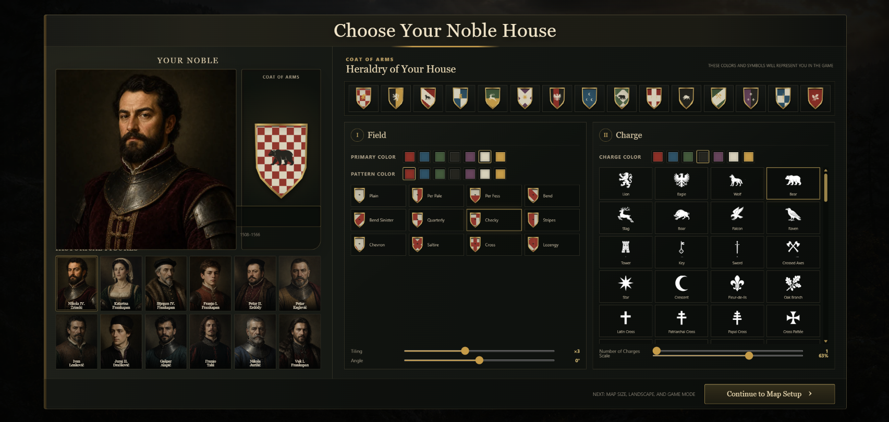

# Selo Empire — Medieval City Builder & Settlement Sim

<p align="center">
  
</p>

<p align="center">
  
</p>

<p align="center">
  
  
</p>

## Run the game locally

This is the shortest way to start the complete game on Windows. You need [Node.js 22.12 or newer](https://nodejs.org/), [Rust](https://rustup.rs/), and the [SpacetimeDB CLI](https://spacetimedb.com/) installed first. The setup commands below use PowerShell.

1. Open PowerShell in this project folder, download the project's submodule and install its packages:

```powershell
git submodule update --init --recursive
corepack enable
pnpm install
rustup target add wasm32-unknown-unknown
```

2. The first time you run the game, start the database and client together, leave them running, then publish the backend from a second PowerShell window:

```powershell
pnpm run dev
```

```powershell
pnpm run deploy:local
```

3. Open [http://localhost:5173/](http://localhost:5173/).

`pnpm run dev` starts SpacetimeDB at `http://localhost:3000` and the Vite client at `http://localhost:5173`, then stops both processes it started when you press Ctrl+C. If SpacetimeDB is already running, the command reuses it and leaves it running on shutdown. `npm run dev` works the same way. On later visits, this single command is all you need. Rerun `pnpm run deploy:local` only after backend, schema, or balance changes.

**Selo Empire** is a real-time medieval city-building and settlement simulation on a procedural 3D landscape. On a fresh game, choose map size, topography, hydrology, forest density, regional resource abundance and variety, and world seed before generation begins. Draw dirt road networks across rolling hills, pine forests, and winding rivers — wooden bridges and graded ramps appear automatically when a path crosses water. Place production buildings to harvest timber, stone, game, berries, and fish; connect wells and depots along those roads; then lay out residence zones so settlers move in over time. Homes need firewood, water, and food: physical haulers stock Marketplace stalls while wells refill from local groundwater, then connected homes receive those provisions through abstract availability instead of a cart visiting every door. Staffed Granaries and Village Storehouses still move real stock into the market. Plant backyard gardens for household consumption, cross-household exchange, savings, and a physically collected local tax; use a staffed Trading Post for general regional trade, while a frontier monastery has a narrow charter to export its own estate surplus. A [SpacetimeDB](https://spacetimedb.com/) Rust module runs the authoritative economy simulation; the client renders replicated state in real time.

Food is physical and keeps its identity throughout the economy: bakeries make bread, hunters supply meat, fishing camps land fish, foragers gather berries and mushrooms, households grow fruit, vegetables, and eggs, and livestock or specialty sites produce milk, cheese, cured meat, smoked fish, grapes, and honey. “Food” is only the meal-equivalent total used by household demand and the HUD summary. Clicking that HUD total opens the stored, carted, household, and surplus breakdown for every actual food commodity.

## Recent updates (July 2026)

- **Authoritative rural commute productivity** — the household routes shown for exposed lumber, stone, mineral, clay, and charcoal crews now affect the economy instead of remaining presentation-only. Once per calendar day, after labor rotation, the server matches staffed workplaces to healthy household and founders'-camp labor by the same road-preferred travel order and stores only a derived shift fraction; production reads that scalar without pathfinding in the hot loop. Long round trips therefore slow timber, stone, iron, salt, clay, and charcoal cycles, making nearby housing and road geometry real industrial choices. A completed, fire-safe linked overnight camp restores its parent yard to a full productive shift immediately, while fire or demolition immediately exposes the cached household commute again. Existing saves default to full output until their first daily review, and the worksite inspector labels the authoritative percentage.
- **Commute-aware work crews and physical overnight camps** — visible workers claim households settlement-wide by real road travel, leave early enough to reach a distant shift, and set out for home soon enough to preserve useful rest. Dawn and dusk never reverse a journey already under way, and a worker who reaches home after dawn still takes a guaranteed six-hour rest. Exposed extraction sites—lumber mills, Mining Pits, Quarries, and charcoal yards—can plan one nearby overnight camp from their own inspector card. It is a real 14-timber/3-stone building: placement must remain within 34 m of its parent, materials are reserved and brought by haulers, builders raise it, fire can disable it, and demolition leaves ordinary reclamation. Only after completion do its two canvas tents and live campfire replace the household commute. Reforester huts, woodcutters' lodges, hunters' halls, foragers' sheds, fishing camps, pastoral farmsteads, and swineherds instead provide canonical built-in crew bunks automatically; barns, apiaries, vineyards, and urban, civic, and processing jobs remain daily commutes. Inspectors report the measured route, effective shift, lodging rule, and linked camp state so distant employment stays a legible settlement choice.
- **Physically watered village forges** — smithies no longer turn ore and charcoal into finished ironwork as a dry, isolated recipe. Every forging cycle now consumes one unit from a visible coopered quench tub, and only completed road-linked wells can supply the workshop by physical cart after fire calls and household needs are covered. Wells are unstaffed infrastructure: the nearest suitable source claims an unassigned hauler when demand is live. Lean, Balanced, Deep, and Fill stock policies stage one, two, or three forging cycles of water alongside iron and charcoal; input specialization, lowest stock ratio, road distance, and stable order decide which thirsty workshop wins a contested well cart. A forge without an operational well on its road branch contributes no sustained ironwork capacity, while its inspector, well ledger, Town Hall material chain, and declining tub surface expose the exact shortage.
- **Settlement-scale household wells** — an excellent aquifer in fair weather sustains at most fifty fully occupied four-person homes; poorer groundwater and drought reduce that yield, preserving pressure to site additional wells as the settlement grows. The well inspector separates the number of homes currently connected from sustainable household capacity, so a small new road branch no longer reads like a two-home hard limit.
- **Physically puddled pottery clay** — potters no longer fire dry clay and fuel as a self-contained recipe. Every kiln cycle now consumes carted well water to puddle and clean the clay before forming, and a kiln without a completed well on its road branch contributes no sustained pottery capacity. The existing workshop stock policy stages one, two, or three water cycles beside clay and firewood; fires and household water remain ahead of industry, then lowest runway, road distance, and stable order decide which kiln receives a free hauler's well cart. Kiln, well, Town Hall, build-card, and HUD guidance expose the dependency, while a stone-lined puddling pit visibly fills and empties with onsite water.
- **Climate-bound charcoal clamps** — charcoal output now depends on the condition of the billet charge instead of running at an identical rate through every season. Wet spring and snowbound winter reduce authoritative clamp cycles to 80%, while drought-dried wood raises them to 110% at the cost of coinciding with the yard's highest fire danger. The same generated policy drives actual firewood consumption and charcoal output, Town Hall and workshop forecasts, input runway, next-day warnings, inspector explanations, and a bounded low-poly smoke plume, turning autumn charcoal reserves and isolated hot-yard placement into one connected planning decision without adding save state.

- **Unified geological extraction** — stone, iron, salt, and clay now share one mental model. Every node has a finite surface reserve worked by a Mining Pit placed nearby; every rich node also has a separate non-depleting underground source worked by a timber-supported Quarry centered on the node. Tooltips use the same surface count and underground-source wording across all four resources. The old Stonecutter's Camp, Mineral Mine, and Clay Pit cards are removed, while their internal identifiers remain as save-compatibility shims.
- **Player-governed extraction yards** — Mining Pits and Quarries share Lean, Balanced, Deep, and Fill yard ceilings for their physical stone, iron, salt, or clay output. Consumer carts may draw below the selected ceiling and restart work; lowering it never deletes stock, but it preserves finite ground, stops deep-support and tool wear, and lets Town Hall production stewardship recall surplus diggers while retaining a needed dispatcher. Every inspector shows current stock, exact headroom, and the four controls. Existing sites default to Fill through the established production-target field, so saves retain former behavior without migration.
- **Live regional import caravans** — paid grain, iron, salt, fittings, provender, water casks, and other imports enter from a deterministic Adriatic-facing map edge on a visible commodity-specific cart. Manual lots unload at their Trading Post before local logistics continue; emergency household and parish-relief orders pass through that post's branch and continue to the exact home that paid for or received them. The empty merchant cart must leave before that post can contract another regional load, so map size, road placement, seasonal pace, trader staffing, and a second post change sustained capacity.
- **Two-way physical regional exports** — staged timber, stone, food, firewood, pottery, barter lots, ale, honey, wine, and cloth normally leave through a Trading Post. A foreign merchant carries each load out through the site's road branch, exchanges only cargo that survives spoilage or a raid, then returns with physical gold or barter goods. The monastery is the one narrow exception: routine mixed-estate surplus may leave directly under its charter and returns as the house's gold-in/gold-out proceeds. The configured export duty is reserved from returned gold for civic collection, while the net stays onsite for automatic estate reinvestment. Player-laid monastery vineyards remain a deliberate physical chain: monks press their grapes at the separate vintner and surplus wine enters town storage. One post cannot overlap regional import and export contracts; local Marketplace stall carts remain independent.
- **Smith-dressed watermill stones and bread-chain ironwork** — grain watermills now join the same physical forge economy as farms, forestry, quarrying, clay digging, and firewood. A mill with dressing hammers and sound iron fittings grinds 20% faster, multiplying rather than replacing spring rain, drought, or frost river power; each completed milling cycle wears 0.25 ironwork, while an empty rack retains baseline output. Smithies cart a three-cycle working buffer by road and remaining runway, and the watermill model shows four declining tool bundles beside its grain and flour stores. Individual mill buffers, road-branch bread capacity, grain draw, output-room timing, and Town Hall ironwork demand all use each mill's actual tool condition. Mining Pits likewise forecast only the tool wear their completed work can incur. Existing saves need no migration and begin with an optional empty mill rack.
- **Physical iron farm tools and seasonal labor compression** — crop farmsteads now join the same smith-forged ironwork economy as forestry, quarrying, clay digging, and firewood. A stocked rack of wooden ploughs with maintained iron shares, hoes, sickles, and scythes makes real ploughing, sowing, and harvesting progress 20% faster; empty racks retain baseline work so an import or smithy failure cannot silently erase a crop. Wear is proportional to completed field work at 0.05 ironwork per baseline worker-day of work, not to ticks or parcel count, so dividing one field cannot evade the cost and workers away with a cart consume nothing. Smithies physically cart a three-stage working buffer by remaining runway and road order, while the farmstead model shows four declining tool bundles. Farmstead, field, and Town Hall inspectors reconcile current pace, onsite and inbound stock, planned wear, whole-season reserve targets, and spring, autumn, or September labor coverage; dormant growing fields drop out of current daily smithy demand. Existing saves need no migration and begin with optional empty racks.
- **Smith-maintained winter-fuel axes** — the existing iron, charcoal, smithy, and firewood chains now meet at every staffed woodcutter's lodge. A lodge with replacement ironwork processes timber 20% faster and wears 0.25 ironwork only after a completed firewood cycle; an empty rack retains baseline output so a smithy shortage creates a meaningful winter-efficiency penalty rather than a settlement-ending hard stop. Every assigned lodge worker processes timber continuously, while an unassigned hauler carries finished firewood and inputs without reducing lodge output. Town Hall firewood capacity, timber draw, tool demand, road coverage, and smithy surplus use the same production-only roster model.
- **Climate-bound cured reserves and player-directed centralization** — cured provisions now follow the same deterministic seasonal environment as crops, roads, and fresh food instead of aging at one year-round rate. Spring damp and autumn humidity modestly raise loss, ordinary summer warmth raises it further, drought is the harshest condition, and winter cold halves ambient aging before each store's protection; the four normal seasons retain the previous annual-average balance. The authority and client apply the current rate to smokehouse lofts, granaries, markets, ordinary holdings, household cupboards, handcarts, and legacy reserves, while next-dawn outlooks, inspectors, food runways, and thirty-day reserve recipes expose the same pressure. The granary's existing intake switch now governs both fresh and cured surplus: disabling it leaves cured stock in the better smokehouse loft, while enabling it spends producer haulage and accepts slightly faster aging in exchange for central redistribution. This connects climate, road layout, cart contention, storage quality, and winter planning without a new inventory or save field.
- **Finite cured-food reserves** — salted and smoked provisions now age slowly in every physical store instead of becoming a permanent calorie bank. The generated balance gives smokehouse drying lofts the best retention, followed by granaries, monasteries, and markets; ordinary holdings, household cupboards, legacy reserves, and exposed handcarts lose quality faster. The authority decays building, cart, treasury-compatibility, and residence stock continuously, including during rest periods, while the client uses the same factors for household runway, road-branch warnings, and Town Hall loss hotspots. Thirty-day fallback targets now include the small quantity that will age while consumed, and production-day, salt, firewood, and pottery forecasts include losses while the reserve is being built. This keeps cured food useful for months without rewarding indefinite hoarding, adds no save fields or parallel inventory, and retains a single linear diagnostics pass at roughly 68 ms for 100,000 granaries.
- **Granary-centered cured-food reserves** — preserved provisions move physically from smokehouses and pastoral holdings into road-linked Granaries, then staffed food stalls place that stock in the Marketplace. Connected tier-four homes receive the real stall inventory through abstract availability, nearest first when it is scarce; Granary workers no longer spend their day carting three-unit ration loads to individual doors. Critical grain, military provisions, brewery barley, preservation, and institutional routes remain physical. Tier-four promotion still requires a sustainable producer plus the appropriate market service, so an empty warehouse cannot fake prosperity.
- **Stock-aware meal and bread planning** — every settlement forecast now follows the same calorie-neutral meal allocation as the authoritative household simulation. A prosperous home first schedules its current seasonal cured ration, subtracts only the amount physically present in that cupboard from today's fresh-food need, and falls back to the gross meal demand when the cured stock runs out. Town Hall bread capacity, household buffers, Sabbath readiness, full-housing growth, residence meal mix, HUD demand, and road-branch runways therefore stop charging prosperous residents for full fresh meals plus preserved food at the same time. Fresh-food runway spends only finite fire-accessible cured stores, at the bounded seasonal rate, before returning to gross demand; disconnected and fire-quarantined smokehouse stock cannot extend a branch. The settlement scan keeps the per-home calculation allocation-free, adds no save fields, and preserves the separate thirty-day all-preserved emergency reserve as a deliberate worst-case target.
- **Calorie-neutral seasonal preserved rations** — prosperous households now actually rotate cured provisions through their meals instead of letting one morsel satisfy the preserved-food expectation forever. The allocator replaces part of the same fresh-food meal rather than charging a second calorie demand, then draws deeper from preserved stock only when fresh food is short. Spring uses 0.75× of the annual-average ration, summer 0.5×, autumn 1×, and winter 1.75×; the four equal seasons still average exactly 1×, while winter becomes the design peak for promotion capacity and summer becomes the natural stockpiling window. Household runway, Sabbath buffers, Town Hall capacity, growth forecasts, smokehouse inputs, salt orders, pottery vessels, and the thirty-day emergency reserve all read the same policy. The authoritative hot path is allocation-free and resolves one million meals in roughly 60 ms under the native debug benchmark.
- **Road-matched winter preservation reserve** — the Town Hall now turns tier-four households' emergency preserved-food fallback into a concrete thirty-day preparation target instead of presenting it as ordinary daily consumption. The ledger matches each occupied tier-four home to preserved stock and incoming carts on its own road branch, excludes fire-quarantined stores, identifies the weakest branch, and forecasts completion from staffed same-branch smokehouses. Every missing unit resolves back into exact fresh food, firewood, salt, and pottery-vessel requirements; stored and inbound salt is counted first, then forecast output from staffed physical salt mines on the same road branch, with ordinary seams capped by their remaining geological reserve. Only the residual shortfall becomes Adriatic import lots and current-rate gold exposure. The planner is a linear, read-only view of the existing physical economy, adds no save fields, and makes mine placement, kiln priority, broker funding, cart routing, workshop placement, and autumn stockpiling part of one visible decision.
- **Physical pottery chain, abstract household availability** — tier-four households require a slow replacement flow of cooking, serving, and storage vessels. Kilns physically supply staffed Storehouses, Storehouses cart wares to Marketplace goods stalls, and connected tier-four homes draw from that real stall stock without individual pottery carts. Smokehouse packing buffers and regional export remain physical competing uses. Tier-four upgrades still require an operational pottery chain and staffed goods-stall access.
- **Player-directed pottery cart priority** — every potter kiln can keep the save-compatible household-wares-first order or stage preservation vessels first. Homes-first protects prosperous cupboards before serving smokehouses; preservation-first protects salted winter-food throughput before replacing household breakage. Either mode immediately falls through when its first local duty has no reachable shortage, and export always remains third, so a nearby broker cannot consume the kiln's one physical cart while either local chain is exposed. The kiln inspector states the exact order and previews the destination selected by that same policy.

- **Deferred settlement ledgers** — the complete inspector and Town Hall reporting graph now leaves the initial application chunk and downloads through the existing settlement-presentation boundary while terrain generation is already under way. The initial production entry fell from 1.735 MB to 990 KB raw and from 493 KB to 310 KB gzip without removing any economic forecast, model, or interaction. A production-build regression test proves the inspector stays outside the entry chunk and enforces 1.10 MB raw / 350 KB gzip startup budgets as future systems grow.

- **Readable settlement Approval** — the top command bar keeps a persistent 0–100 Approval score, named tier, and short-lived trend arrow in view. Clicking it opens a compact ledger of the strongest supporting factors, the needs that deserve attention, and the growth, taxation, residence-promotion, and cohesion effects already enforced by the simulation. The score is derived client-side from authoritative provisions, welfare, hunger, illness, sustained household service pressure, cohesion, winter warmth, burials, fires, fatigue, and active frontier danger, so it adds no duplicate save state or competing simulation authority.
- **Persistent homes and actionable settlement welfare** — homes never become abandoned or decay from vacancy. Death simply frees reusable capacity for future settlers. A three-day unmet-need grace period is followed by approval pressure; six days blocks tier promotion, while household work, market activity, and assessed tax continue at their normal rates. Hunger, malnutrition, sickness, remedies, service pressure, mortality, burial carts, grave capacity, and reusable housing resolve into one shared Town Hall summary, while the HUD appears only for real watch or critical conditions. The summary is folded into the existing provisioning residence pass rather than adding another snapshot scan.
- **Household-first fuel economy** — staffed Village Storehouses physically stock Marketplace goods stalls, which allocate firewood instantly to connected homes; nearby households receive scarce supply first and no worker is reserved for the last mile. Remaining source stock can still travel physically to bakeries, breweries, smokehouses, charcoal clamps, or pottery kilns. Industrial dispatch is source-side and deterministic: staffed workshops compete by lowest recipe-cycle runway, road distance, and stable identity, so table update order can no longer decide which production chain stays hot. An idle workshop cannot sequester communal fuel, while each processor's output-stock target controls whether it stages one, two, or three firewood cycles. Lodge and storehouse inspectors preview the next industrial claim and active destination. The Town Hall separates cupboards, market stock, hot-workshop buffers, live carts, inactive stock, and fire-quarantined stores; it also compares full-winter hearth demand plus installed industrial burn against sustainable staffed-lodge output and timber draw on every road branch. Existing saves need no migration.

- **Legible industrial fire planning** — the severe accident risk already carried by charcoal clamps and smokehouses, and the elevated risk at smithies, pottery kilns, fuel-heavy workshops, barns, breweries, and granaries, now becomes a layout decision before construction instead of a hidden coefficient. One generated balance table feeds both the Rust ignition authority and client forecast. Placement and inspector readouts report current stored-fuel amplification, operational buildings and occupied homes exposed within spread range, the selected well route, and estimated first-bucket arrival without drawing an exact radius in the world. A busy nearest well now yields the emergency to a farther ready responder instead of blocking the entire response. This adds no save field or periodic settlement scan, and the derived planning pass remains near 14 ms for 100,000 buildings.
- **Directional, uncertain raid warnings** — the exact incursion schedule is no longer exposed as a guaranteed HUD timetable. Ordinary scouts and travelers may miss an approach, although larger raiding parties are progressively harder to conceal. A staffed watchtower reliably detects only the actual map-edge lane reached by its effective sight radius: one lookout has a smaller detection footprint, two have the full radius, an outward tower provides more lead time, and a tower on the wrong side of the map provides none. The authority persists the planned side so a reported northern approach cannot become an eastern spawn if stored wealth shifts before contact. A successful report raises a toast with source, direction, party size, and an approximate countdown; an undetected raid instead raises an immediate contact alarm. Likely-target markers remain hidden until a real report or physical contact.
- **Committed cart round trips** — work hours and an observed Sabbath still block every new ordinary-cart departure, but a crew already on the road now finishes its outbound leg, unloads, and returns home instead of freezing at 20:00 and resuming in place the next morning. Fire response retains its emergency exception, while a live raid still recalls exposed outbound carts and lets returning carts complete their retreat.
- **Physical fire displacement** — a fire-disabled workplace no longer leaves its visible crew forging, harvesting, drilling, or standing inside the burning site while the authoritative economy is paused. The same rostered people put away their tools, evacuate over the real local route to their household or founders' camp, remain inspectable as fire-displaced, and commute back only after recovery; their labor assignment is not silently freed. Residents who are actually home leave the house for deterministic assembly places beyond its footprint, while household members already working at a safe site keep producing so presentation does not invent a server-side labor loss. During a frontier alarm, a burned guard post no longer grants defense-duty immunity and a burned refuge cannot receive a rally. Fire-disabled homes immediately lose ordinary hearth smoke and window light, and their residents physically return after recovery. The routine adds no save fields and remains bounded by the existing 1,024-agent crowd ceiling.
- **Player-directed loom inputs and fibre routes** — every weaver can now use the legacy automatic recipe choice, prefer a ready wool cycle, or prefer ready flax plus hauled water. Among active looms, sheep-holding and farmstead carts replenish a matching specialization before the neutral Auto pool and the opposite fallback, while covered working buffers return to nearest-route overflow. Flax-first looms with fibre physically staged also enter the well's household-first industrial queue ahead of neutral workshops, while wool-first looms yield contested water; this replaces update-order-biased target pulls with the same one-pass source-side arbitration used by bakeries and brewhouses. The alternate recipe remains a production fallback so a stocked workshop does not idle, and authoritative dispatch, client route previews, production, Town Hall input-runway forecasts, well and workshop inspectors share the policy. Wool-first saves planned flax for later; flax-first turns field fibre and well/cart capacity into cloth while preserving the annual fleece clip. Existing workshops default to automatic selection. Fibre, industrial-water, inter-building cloth, and export hauls remain physical; household water and market-cloth availability are abstract after reaching their distribution point.
- **Inspectable, fordable live combat** — every replicated raider and defender can now be selected in the ordinary person inspector to read their current objective, health, equipment, readiness, captured stores, and exact activity instead of inferring the battle from an aggregate alert. Combat visuals use the existing road-surface sampler while taking a bridge, so fighters no longer appear below its deck. Rivers remain intentionally fordable cross-country terrain for both sides, reflecting the settlement fantasy of shallow Gorski Kotar and Kupa-valley crossings: a river or delta cannot become an invulnerability wall, while roads and bridges retain their faster coordinated-route advantage.
- **Audible physical melee** — close inspection of a live fight now carries sparse, generated polearm impacts, shield contact, equipment movement, and nonverbal human exertion from the combatants' actual map positions. Approaching, retreating, downed, and ordinary-duty agents remain silent; distance attenuation and the strategic-zoom cutoff keep the settlement soundscape readable, while pausing or ending the engagement stops in-flight sounds immediately. One source per active raider, a twelve-source ceiling, shared one-shot pools, and global cadence limits keep the pass bounded even when many defenders answer the alarm.
- **Physical raid contact and exact loot** — every building, cottage, treasury seat, and refuge now receives a deterministic exterior assault point on the raider's approach side instead of drawing attackers through its model center. The authority derives building envelopes from the shared placement catalogue, uses the authored cottage radius, keeps moving carts on their live position and broader interception radius, and ends cached incursion routes at the same physical contact. Raiders visibly strike stationary holdings throughout forced entry, while moving-cart plunder remains a rummaging action and guards may leave roads to intercept anywhere. When several raiders share a target, complementary carrier shares now reproduce the declared loss budget exactly if all succeed instead of compounding below it; only agents that actually finish contact carry anything away. Interrupted or reconnected wounded guards also return their issued polearm to the rack only after physically reaching their guardhouse.
- **Authoritative on-map frontier combat** — due incursions now spawn a bounded party of replicated raiders at a deterministic map edge instead of applying an off-map loss roll. Each raider owns a live position, target, health, combat state, and carried-loot bundle; each responding guard is backed by one armed slot in an actual guardhouse roster and temporarily replaces that worker's ordinary crowd figure. Roads are a faster preferred leg, never rails: guards and raiders cut across country to intercept, chase carts, fight, reach an active attack, or answer an unlinked holding. Both sides physically close distance and exchange melee damage, using the villagers' authored movement and weapon-swing animation with the existing audited CC0 spear. A raider must reach the exact building, home, treasury seat, or moving cart and spend four local seconds looting before its authoritative stock can change; arson is possible only after that contact, and carts cannot be burned as structures. Stolen commodities travel back out on the raider, while an intercepted carrier drops the exact bundle into a recoverable map stockpile. Capable raiders who are advancing, fighting, looting, or physically retreating directly govern refuge rally and the settlement-wide emergency stop. New ordinary-cart departures cease, carts caught outbound or unloading reverse along their physical route with the same crew and exposed cargo, already-returning carts keep moving, and fire responders continue; pursuing raiders still chase the cart's live position and can plunder only after contact. If a pursued cart reaches home first, the same live pursuit transfers to its receiving store before the cart row clears; its loss fraction is rescaled to the remaining cart value so arrival cannot despawn an attacker or expose an unrelated warehouse windfall. Combatants and carts advance on the same five-heartbeat physical cadence at the selected game speed instead of making battles wait on sparse calendar/economy steps. Once the last hostile escapes or falls, ordinary work, carts, migration, and household settlement resume while guards continue their visible return and recovery. Survivors must physically escape and guards must walk home before the final report is recorded. Peaceful worlds clear the combat lifecycle entirely, simultaneous multiplayer raids are owner-isolated, party size is capped at twelve, and the hot movement/combat policy remains deterministic and benchmarked.
- **Persistent guard casualties** — a guard downed in physical combat no longer disappears into an abstract result or returns to duty at the next update. That same replicated roster agent remains on the battlefield, limps back to its source guardhouse after the raiders are gone, and recuperates visibly for three to five in-game days; a well-supplied, paid company recovers faster. Its exact roster slot cannot muster again, be released into another workplace, or be erased by demolishing or reconstructing the guardhouse. Wounded guards continue to consume company provisions and wages, the authoritative district forecast subtracts them, and the HUD plus guardhouse ledger distinguish fighters in the field, evacuation, on-site recovery, fit strength, and remaining recovery time. Recovery reuses the existing combat-agent row and state tick, so old saves need no migration or parallel casualty table.
- **Player-directed company muster posts** — a completed guardhouse can now keep the save-compatible nearest-watch order or be bound to one chosen completed watchtower. An explicit order lets a rear company reinforce a threatened district without rebuilding the post, but its real road length and seasonal travel penalty still reduce timely strength; if that watch is unstaffed, burning, or cut off, the company waits rather than silently teleporting to a safer district. The guardhouse ledger previews every post from one batched road tree, exposes the active order and failure state, and the selected route, raid forecast, visible spear muster, and authoritative raid outcome all consume the same assignment. Demolishing the post safely returns its companies to automatic duty. One additive zero-default building field preserves existing saves and adds no new unit, commodity, or per-tick scan.
- **Visible road-linked guard musters** — when raiders are reported during the April–October campaign season, every equipped guardhouse worker now leaves ordinary drill, follows the same road-linked watch claim used by the raid forecast, and forms a deterministic spear line clear of the tower ladder. Several companies answering one watch extend the formation instead of overlapping; watchmen remain on the gallery, while unarmed, disconnected, or fire-disabled companies do not falsely appear in the response. Guards return to their guardhouse when the alert clears. The forecast and crowd presentation reuse one batched muster plan—one road tree per company—so no route is solved twice, and the change adds no save field or new asset beyond the existing audited CC0 hand-rigged spear.
- **Visible civilian refuge rallies** — once raiders are reported during the April–October campaign season, rendered members of every assigned household leave ordinary routines, follow roads and yards to their claimed palisaded refuge, pass through its open gate, and occupy one of 32 deterministic places inside. They return home—and workers resume their normal commute—when the alert clears; winter pauses and peaceful worlds never trigger a rally, while defense workers remain on duty rather than taking civilian places. The raid forecast and crowd presentation reuse one capacity assignment instead of sorting the settlement twice, add no save state, and make overlap, overcrowding, fire loss, and exposed homes readable directly on the map.
- **Capacity-bound civilian refuges** — each compact palisaded enclosure now holds at most 32 residents instead of sheltering an unlimited village. Warned families claim places as whole households at their nearest active refuge, then try an overlapping second enclosure when the first is full; anyone who still lacks room remains exposed, and a burning refuge removes its capacity immediately. Refuge and Town Hall ledgers show demand, assigned places, and the remaining gap, while the server and client share the same deterministic rule. The assignment uses spatial buckets plus one bounded candidate sort, adds no save field or artwork, and remains comfortably bounded across 100,000 households.
- **Road-linked watch districts** — each supplied guard company now reinforces only its nearest staffed watchtower over an exact road route, so a strong central muster can no longer defend a disconnected satellite holding by virtue of a settlement-wide guard total. Incursion targeting, portable-stock loss, arson pressure, frontier markers, the HUD, and the Town Hall all evaluate the guards that can answer each physical holding; burning towers or companies immediately remove their local protection, and weather-softened roads weaken long musters. Overlapping warning areas may combine genuinely distinct companies, route ties are stable, and the authority and client each reuse one batched road tree per company. The rule adds no save field and keeps the 10,000-holding client projection comfortably bounded.
- **Enclosed frontier monastery estates** — a Pauline monastery is no longer a second church model. Placement reserves an authoritative asymmetric 68 × 53 metre parcel, including its complete perimeter fence, and requires the whole estate to fit inside the outer 60 metres of the map. The fixed compound visibly includes a mixed apple-and-pear orchard with its own cider press, kitchen and physic gardens, pollinator beds, hives, chickens, goats, pigs, and a protected cattle-and-sheep pasture, plus a mead brewhouse and a separate vintner and wine cellar. Players do not choose individual fruit or vegetable varieties: ordinary estate activity is presented as abstract chartered proceeds. The orchard canonically makes one house cider, and apiary honey becomes monastic mead for the table and hospitality—never monastery ale. Player-laid vineyards are the physical exception that enters the settlement economy; monks harvest grapes and work the vintner to produce actual wine. Four independently ordered extensions—infirmary, scriptorium, guesthouse, and estate workshop—add visible buildings and services inside the already reserved precinct rather than acting as linear tiers or expanding plots. Export duty is set aside on returning gold and the net funds those projects. Finite infirmary beds consume estate food, prioritize homes with the shortest remedy runway, and improve recovery and mortality on top of ordinary household herbs. Routine alms remain a church responsibility, while monastery charity takes the form of finite nursing and scheduled communal feast days.
- **Exclusive parish-monastery territories** — every household now belongs to its nearest completed, fire-safe Pauline monastery only when it already lies in a staffed road parish and the monastery is chapel-linked within its physical coverage. Overlapping houses no longer receive duplicate feast benefits from whichever monastery row happens to run first; each observance serves only that monastery's claimed homes, while a burning chapel or monastery immediately suspends the link. The authority caches one exact territory per settlement substep and reuses it for residence growth, recovery, chapel attendance, and feast recipients; the Town Hall builds the same forecast in bulk. This replaces repeated household-by-monastery Dijkstra searches with one batched road tree per landmark, adds no save field, and makes monastery placement a legible road-topology decision.
- **Shared free-form agricultural parcels** — grain fields, fenced pasture/pannage, and vineyard terraces use one four-independent-corner placement language, matching the free-form rear edges used by residence zones instead of expanding a forced rectangle from one baseline. A completed pastoral farmstead begins unstocked and requires an explicit cattle-or-sheep choice before pasture can be fenced; species-specific starter animals arrive only after that decision, while existing saves retain their established herds. Each parcel keeps its own agronomic rules: crop and vineyard suitability, holding work extents, animal slope limits, and enclosure visuals remain specialized. Polygon area and centroid math are authoritative on both client and server, existing rectangular saves retain their exact yield, and skewed or elongated fields pay a modest visible shape-efficiency cost in both labor and harvest. The live preview shows the open boundary before the parcel closes, rejects crossed or concave outlines, and samples a bounded 5×5 grid across the whole parcel so land cannot bridge open water or a quarry between apparently safe corners. Deterministic hand-laid variation now softens field banks, vine rows, vineyard borders, and inward-running pasture rails while leaving the authoritative corners unchanged.
- **Policy-driven apiaries and real pollination** — an apiary now derives a bounded forage score from mature woodland, orchards, flower gardens, and vineyard rows within bee range. Conservative, Balanced, and Extractive harvest policies trade current honey yield against a protected reserve. Each December the colony consumes up to eight physical honey; a shortfall damages persistent colony health and next season's output. Healthy nearby hives add a distance-weighted, globally capped 15% pollination bonus to orchard and vineyard harvests, so flowers and mixed land use have value without minting passive money.
- **Grape allocation and staffed fermentation** — vineyards always harvest physical grapes. Table-grape, Balanced, and Wine-first policies decide how many remain protected for food before a staffed cellar withdraws a complete three-grape batch. Fermentation then advances over sixty worker-seconds and deposits three wine only when the cask store has room; changing policy never converts stock instantly. Vineyard parcel quality and nearby pollination affect grape harvest, not the cellar's conservation math.
- **Comfortable-household local spending** — tier-two and higher homes with safe food/firewood/water buffers and more than 24 gold may make one small evening discretionary purchase from a staffed, road-linked Trading Post. The selected ale, wine, honey, cheese, cloth, or pottery is physically removed, spending is capped per person and per day, and the buyer never crosses the protected savings floor. A Tier-4 non-vital shortage gets a three-day logistics grace period, then trims both the household's optional purchase limits and the resulting local market tax by 25% until service recovers; labor, output, housing, and tenure are unchanged. Coin becomes private local producer proceeds plus the selected local activity tax; physical settlements stage it at the post for the existing poorest-household payout carts. Lifetime local spending and producer-income totals remain auditable at the Town Hall.
- **Crop-specific field suitability map** — laying out a field now reveals one terrain-draped poor-to-prime map for the selected crop, and cycling rye, oats, barley, flax, maslin, or fallow immediately recolors the same cached overlay. Each sample combines the authoritative groundwater map, predicted starting soil, and terrain slope; the finished parcel readout adds exact size and shape effects to show first-harvest output before commitment. A compact legend explains the colors, the ordinary water map is temporarily hidden and restored on exit, and the overlay is one lazy mesh with cached 192² textures, no save state, no simulation ticks, and no per-frame terrain sampling.
- **Yield-sacrificing early harvest** — from 55% growth in August, a farm field can be cut before the normal September harvest to spread a holding's labor peak or secure emergency grain and fibre. The field permanently locks 47–85% of its normal yield from current ripeness, then uses the same workers, storage limits, physical farmstead stock, and later cart routes as an ordinary harvest. Field and holding forecasts preserve that sacrifice across saves and reconnects, and the inspector shows both the reduced output before confirmation and the locked decision afterward. Existing fields default to full yield.
- **Physical parish alms purses** — in physical-economy settlements, a chapel now batches one workday of charity into a visible gold purse and assigns one genuinely free villager to carry it along the road to the poorest eligible household. The coin remains in the coffer until departure, stays exposed to fire and raids while moving, enters household wealth only on unloading, and advances the parish charity ledger by the amount actually received; rejected or interrupted purses return without loss. Long routes, rest hours, missing roads, labor shortages, and the chapel's single competing cart now delay assistance, while chapel and Town Hall ledgers expose the exact cooldown, route, active cargo, and blocker. The existing chapel cooldown stores cadence without a schema addition, and legacy non-physical saves retain direct per-tick charity.
- **Physical monastery feast gatherings** — the five annual observances map onto real dates in the settlement's compressed ten-day months. Covered household members now leave work or home, follow the same authoritative parish roads to their claimed Pauline monastery, gather outside its walls, and return afterward; fire, broken road coverage, conflict alarms, or a disabled feast policy prevent the trip. At noon the authority withdraws a complete batch of 18 food, 4 honey, and 10 cider, mead, and/or wine only at that physical monastery and only with at least one covered home. Orchard cider and mead stretch the common table, vintner-made wine raises offering prestige, and any mixed cellar earns a modest hospitality bonus. When stocked, the table explicitly receives portions of estate meat, cheese, and milk before the general orchard, garden, egg, and pantry supply completes the meal. The meal clears immediate food and eligible beverage deficits without adding a single unit to household pantry stock, eliminating the former invisible monastery-to-home transfer. A short pantry preserves all stock for the next observance, and monastery/Town Hall ledgers still expose the exact deadline, shortages, ready pantries, and annual commitment.
- **Commodity-readable specialty trade post** — ale barrels, honey jars, wine casks, folded cloth, cheese, and pottery appear at the Trading Post only while that physical stock is waiting for a trader. Drinks, provisions, and wares each have independent seasonal demand, price recovery, and Any/Fair/Favorable export floors; selling one family depresses only that market. Each queue fills and clears in coarse bands as producer carts unload, local comfortable households buy small lots, policies hold cargo, and regional traders export the eligible remainder.
- **Lossless seasonal harvest backpressure** — apiaries wait for room for one complete honey harvest, while vineyards wait for room for one complete grape harvest independently of later fermentation. Their inspector names the exact full store and missing room, making harvest policy, table reserves, cellar capacity, hospitality, roads, and seasonal cart timing genuine constraints. Apiary honey jars and vineyard grape baskets or wine casks fill and clear only from authoritative onsite stock; the obsolete empty apiary “food” basket is gone.
- **Inventory-readable frontier armory** — the carpenter now exposes its real timber, imported iron fittings, and finished polearms, while guardhouse ration crates and weapon racks reflect only supplies physically present. On muster, each exact guard agent carries one issued company polearm; that weapon disappears from the rack, is excluded from onsite raid plunder and store-value forecasts, and reappears only after its carrier physically returns. A wounded low roster slot no longer strands a weapon when a later fit villager can take it. The guardhouse ledger separates rack, carried, and total company arms, while coarse stock bands make workshop starvation, output congestion, cart collection, and company readiness legible from the map. Existing saves need no migration because issued equipment reuses the combat agent's carried-store record.
- **Inventory-readable wild-food suppliers** — hunter drying rails, forager herb bundles, and fishing racks reflect the fresh food physically held at each source instead of remaining permanently full. Their authored props fill and clear in coarse bands as gathering, collection toward Granaries and Marketplace stalls, institutional use, and spoilage change onsite stock. The suppliers reuse their current meshes and authoritative food rows, adding no save fields, polling loops, or decorative draw calls.
- **Inventory-readable extraction yards** — the woodcutter's lodge, Mining Pit, and Quarry show the material they actually hold rather than permanent decorative stacks. Their storage props fill and clear in coarse readable bands as workers produce and carts collect material. The yards reuse existing regional building geometry, add no save fields or per-frame polling, and keep collider updates independent from inventory changes.
- **Inventory-readable food chain** — the granary, watermill, brewhouse, and smokehouse now expose their authoritative stores directly in the world. Grain and provision sacks, grain and flour staging, malt sacks and shared ale/cider/mead cellar barrels, and the smokehouse's fuel, fresh-food, and preserved-food racks fill and clear in quantized segments as carts and workshops move stock. Existing props were converted into state-driven groups with only a few extra sacks where input and output needed separate silhouettes; no save fields or per-frame polling were added.
- **Physical barley and malting chain** — barley is now a distinct harvested, seeded, stored, traded, hauled, and raidable commodity rather than hidden inside bread grain. Farmsteads protect matching barley seed, carts route surplus to granaries or selected brewhouses, and brewers spend one watered, fueled work cycle making physical malt plus a second cycle turning that malt into ale. Separate world sacks, HUD transit counts, workshop buffers, and Town Hall forecasts make labor, storage, road, and reserve bottlenecks readable.
- **Distinct flax and wool textile routes** — field flax no longer turns into sheep wool at harvest. It remains a physical, raidable flax-fibre commodity from farmstead to cart to weaver, where one hauled unit of well water is needed alongside three flax for each two-cloth cycle; three wool can make the same cloth through the dry route. The workshop automatically uses the route with more complete onsite cycles, while separate HUD totals, handcart loads, farm and loom stockpiles, processor buffers, and Town Hall road ledgers expose the resulting crop-versus-flock, water, storage, labor, and topology decisions. Retting, breaking, and spinning are folded into that water-bound workshop cycle so the historical constraint adds depth without three one-use intermediates.
- **Weather-powered watermills** — Gorski Kotar's stream flow changes the real milling cycle instead of serving as scenery. Spring rain raises watermill throughput to 115%, summer drought lowers it to 65%, and frozen mill races stop watermills entirely in winter. Flour reserves or a windmill are therefore necessary for year-round milling, while a windmill only reaches maximum capacity on strongly exposed ground. The next-dawn forecast, Town Hall production ledger, mill inspector, and wheel speed all use the same generated balance values; the policy adds no save fields and only one tiny per-frame wheel rotation per visible mill.
- **Inventory-readable Village Storehouses** — communal timber, quarried stone, and cut firewood bays now fill and empty in discrete visible segments from the storehouse's authoritative stock. An empty depot no longer presents a permanently full yard, so collection targets, household-fuel dispatch, construction drawdown, and the last founding-camp cart all leave immediate world-space feedback. The existing meshes are only visibility-toggled at stock thresholds, adding no simulation state, draw calls, or per-frame work.
- **Physical founding-stockyard clearance** — once every founder has a residence place, one free villager at a time carts every portable holding out of the temporary founding yard. Uncommitted timber, stone, and firewood follow storehouse intake policies and collection ceilings; provisions prefer granaries, drink and trade goods prefer markets, wool and cloth move toward looms, iron fittings and polearms move toward the frontier workshops that use them, water returns to a well or wet workshop, and the lockbox travels separately to the Town Hall. Dedicated stores outrank closer overflow buildings, active receivers and fire-disabled destinations are skipped, construction and household-improvement reservations stay at the camp, and the inspector names the exact commodity, destination, road, labor, capacity, or policy blocker. The tents, stockyard, and lockbox therefore retire through the settlement economy instead of a hidden cleanup rule.
- **Bounded forest succession** — dense SeedThree stands now gain deterministic, low-cost understory crowns only in corridors between existing trees. These crowns reuse the cheapest authored foliage cards, never add harvestable stock or collision, avoid roads, water, buildings, and the founders' meadow, inherit their parent tree's felled state, stay out of first-person view and the shadow pass, and are compacted with the existing camera-visible instance sets. The reusable neighbor derivation lives in the SeloSlav SeedThree fork and remains spatially bounded rather than scanning every tree pair.
- **Readable seasonal environment** — rain now occupies more of the visible overview and keeps wider, softer procedural streaks without increasing its two-layer draw budget. Distance-gated terrain detail reduces overview shimmer, river flow and shore clusters read more clearly, and moonlight, water return, and the founders' fire preserve nighttime legibility; refreshed daylight, moonlight, rain, and winter frames verify the combined pass.
- **Fuel-fired brewing** — brewhouses now consume one physical unit of firewood per ale batch and stage a small target-governed fuel buffer by road from woodcutters or village storehouses. Fuel travels on visible carts, an empty hearth stops production, capped workshops stop accepting surplus wood, and the building and Town Hall inspectors expose firewood as both a current bottleneck and a daily capacity cost. Brewing now competes directly with household heating, granary ovens, and smokehouse preservation without adding a new resource or save field.
- **Roster-safe logistics cart crews** — production workers remain on site and never alternate between output and delivery. Ordinary producer, construction, salvage, well, and civic trips reserve unassigned workers for the full handcart round trip; only dedicated Storehouse, Granary, and Trading Post logistics posts travel from a building roster. Reducing one of those logistics rosters does not make a worker already traveling immediately reusable: the reservation remains authoritative until return. Building inspectors explain the delayed release, while the Town Hall separates total cart crews from workers reserved outside current rosters. Donor selection batches active carts into one building map, keeping large-settlement rotations linear without another save field.
- **Authoritative freelance cart labor** — every physical cart records crew reserved outside its origin building's labor roster. Founding-stock, reclamation, and chapel-gold errands reserve that villager from departure, so one nominally free worker cannot be assigned to a building or duplicated across institutional runs mid-journey. The HUD, building controls, and Town Hall expose the same committed workforce; the server labor check reads one authoritative budget instead of reloading every active trip origin. The additive defaulted field preserves existing saves and the bounded client forecast remains a single pass over active carts.
- **Independent parish economy** — chapel coin stays inside a visible church-owned coffer: a full chest pauses new parish tithe instead of overflowing into an abstract ledger, while the monastery share remains sealed and unavailable to wages, upkeep, or charity until a free villager carries it along a valid road. Parish money funds clergy, maintenance, alms, poor relief, and linked monastery obligations; neither manual collection nor an automatic sweep can transfer it to the civic treasury. Cancelled monastery runs restore the pledged purse, lifetime tithe advances only on unloading, chapel and monastery chests appear only while funded, and deprecated transfer fields remain only for additive save compatibility.
- **Physical civic lockbox transfer** — founders' gold no longer jumps into a completed Town Hall. A free hauler now carries the visible lockbox over the road network, the camp explains missing hall, road, or labor blockers, and the Town Hall exposes a visible treasury chest plus incoming gold. The handoff reuses the existing cart and inventory rows, so it adds no save fields.
- **Physical cottage and backyard reclamation** — removing a cottage no longer teleports its recoverable timber and stone into a remote settlement total. Every intact home leaves a separate, visible pile on its former footprint, while fire-damaged homes yield no reusable structure; clearing a whole burgage therefore creates a real cleanup workload instead of one abstract refund. Removed orchards, gardens, and hen yards leave smaller piles in their backyards and cannot be rebuilt until a free hauler reaches road-connected storage with room for both materials. The existing pile mesh visibly declines, construction may claim reclaimed structural stock before depot cleanup, and each footprint clears only after its goods and carts are gone. Existing pre-camp saves retain their former abstract refund behavior, and the change adds no save fields.
- **Persistent cart-staged bulk trade** - physical-economy settlements can no longer sell or barter goods straight out of a distant road-linked store. One staffed-market order sends the nearest free, healthy source to load a visible cart, automatically dispatches follow-up loads until the full lot is physically staged, then settles at the prevailing regional rate. The inspector shows the active order, local progress, inbound state, blockers, and a safe cancel action; canceled carts still unload and their cargo remains real market stock. Construction reservations, household reserves, burning stores, busy carts, and disconnected branches remain protected, while pending firewood or food is held from routine household distribution until its chosen export settles or is canceled. Legacy saves retain direct exports, and old physical-economy saves default to no active order through one additive compact field. Candidate routes share one batched distance tree per dispatch instead of running Dijkstra once per store, while only active orders join the existing staggered market cadence.
- **Physical founding camp and treasury** — every new settlement now begins at one deterministic, terrain-aware camp instead of beside an abstract resource ledger. Its placement preview gives a non-binding logistics outlook for groundwater, nearby mature timber, stone, wild food, and workable field ground, so an irreversible founding choice is informed without turning a weak site into a hard failure. Five visible founders wait there until real homes absorb the original population; the shelters then clear while the open stockyard remains. Starting timber and stone are rendered as diminishing stacks, reserved from that Building row, and carried to construction by visible handcarts—even before the first road exists. Starting gold sits in the camp lockbox and moves into the first completed Town Hall. Because this bootstrap anchor can neither be demolished nor placed twice, it is structurally fire-safe; its portable goods remain physical and become ordinary raid targets once frontier pressure reaches a developed settlement. The empty stockyard removes itself only after housing, a Town Hall, and a Village Storehouse are complete. Developed legacy saves keep their established population count but convert every abstract holding into a visible recovery stockpile beside their Town Hall or earliest settlement anchor, so future goods obey the same physical storage rules without granting a free second camp. While that conversion propagates, the compatibility row is neither spendable, raidable, nor counted as fuel; only its visible recovery pile enters the physical economy.
- **Raid-vulnerable legacy reserves** — demolishing a forecast target or recovering an interrupted cart can no longer teleport its portable goods into raid immunity. New settlements expose their camp, Town Hall, and other real stores as ordinary physical raid targets; any abstract reserves retained by older saves compete in the same bounded target budget as building stores and household wealth, anchored to the earliest Town Hall or fallback holding. The forecast names and marks that seat, watch coverage can protect it without granting immunity, and reconstruction does not move an established Town Hall reserve elsewhere. Timber already promised to construction remains backed, while stone and water stay outside plausible plunder. The client uses one allocation-free classification pass.
- **Textile-aware frontier plunder** — wool and finished cloth now make exposed pastoral holdings and weavers genuine raid targets on both sides of the simulation instead of inflating the authoritative forecast while remaining mechanically immune. One tested portable-store record now drives server valuation and removal for every carryable building commodity, preserving cloth, ironwork, and polearm value weights while keeping stone and water outside plausible plunder. Likely-target feedback identifies the dominant stores attracting each raid, projections refresh on the same bounded 300-tick cadence as the authority, and the Town Hall now exposes the threat timetable, watch coverage, muster, projected losses, and last outcome. November–March reports clearly show the campaign pause when an elapsed threat clock is waiting for April. The change adds no save fields and retains the bounded target selector.
- **Fire-quarantined parish finance** — chapel coffers remain physically church-owned but become unavailable for tithes, wages, upkeep, charity, poor relief, and monastery remittance while the chapel is damaged or under reconstruction. Fire-disabled homes leave parish territories, tithe forecasts, alms selection, monastery coverage, and Monday relief routing until recovery instead of appearing as road failures or valid recipients. Chapel, residence, and Town Hall views separate active from structurally sealed parish gold and link directly to the first unavailable parish structure. The Town Hall tithe estimate batches nearest-road claims instead of rebuilding the chapel roster for every home; the matching projection covered 100,000 homes with 25,000 outages across eight parishes in about 355 ms without new save fields.
- **Fire-suspended household economy** — a damaged home now leaves the active settlement pipeline everywhere the authoritative simulation pauses it: no settlers advance through its vacant rooms, no backyard food, trade, tax, or household income is forecast, and prosperous occupants create no preserved-food, ale, cloth, or pottery demand until recovery. Owned housing, residents, gardens, and cupboard stock remain visible as fire-disabled rather than disappearing; carts approaching a disabled home and cloth or pottery at affected workshops remain physical but cannot promise household endurance. Fire-disabled sheep holdings expose their annual clip as unsecured, while Town Hall housing, prosperity, garden, and textile rows state the exact outage. Residence upgrades are now rejected both in the interface and by the server while the home is damaged, and burned suppliers cannot satisfy authoritative upgrade services. No save fields were added; growth still audits 100,000 homes with 25,000 outages in about 102 ms.
- **Fire-quarantined provision planning** — damaged granaries, food suppliers, fuel depots, guardhouses, and homes now retain their physically owned stock without letting it promise settlement or road-branch endurance. Town Hall and HUD forecasts separate usable food and firewood from quarantined reserves, exclude displaced households from impossible consumption, Sabbath, and delivery-buffer warnings, and reject carts approaching a disabled destination. Fresh food in damaged buildings still appears in spoilage losses while suspended household cupboards follow the authoritative paused residence step; disabled granaries lose collection capacity until repaired. The forecast builds one building set and one residence set, adds no save fields, and still audits 100,000 homes with 25,000 household outages in about 105 ms.
- **Fire-vulnerable frontier defense** — fire-damaged watchtowers now lose warning coverage and invalidate their road-linked muster routes, while damaged guardhouses contribute no ready guards, consume no provisions or wages, and cannot make onsite polearms count as a serviceable company. The authoritative raid forecast builds one owner-scoped disabled set before evaluating watches and companies; the client uses the same outage rule for target projections, inspectors, payroll, provisions, and the Town Hall armament ledger. Burned carpenters and construction stores likewise stop promising ready polearms or armory inputs, with owned but stranded weapons and ironwork remaining visible rather than disappearing. The resulting temporary coverage collapse makes fire recovery a genuine frontier priority without adding save fields or a parallel military system, and the bounded client forecast still covers 100,000 holdings while half of 1,000 watches are offline.
- **Settlement fire-recovery ledger** — the Town Hall now turns simultaneous accident, lightning, spread, or raid fires into one actionable emergency queue. It totals answered and unanswered bucket calls, water still requested, suspended workers, disrupted residents and housing, cooling versus ready structures, repairs versus rebuilds, current material liability, and timber or stone shortfalls. Active attention favors an unanswered fire before the highest remaining intensity; safe recovery favors an actionable site, affected people or workers, destruction, damage, and stable building order. Road-linked operational carpenters discount only targets on their own connected branch, and every recovery link opens the affected structure. Fire-damaged chapels also stop triggering Sabbath work pauses across the server, HUD, economic forecasts, and inspectors until repaired. The ledger adds no save field, uses road-component membership instead of repeated route solves, and planned 100,000 simultaneous incidents in about 45 ms.
- **Fire-resilient supply territories** — structural damage now takes a building or household out of every ordinary service claim and new-cart selector, not just its own production step. Healthy wells, food stores, fuel depots, specialty workshops, grain processors, lumber mills, and guard suppliers immediately inherit reachable demand instead of losing territory to a nearer burned-out rival; damaged destinations likewise stop attracting household, workshop, depot, and military cargo. Shared trip-start boundaries recheck both endpoints, so future production chains inherit the same quarantine even if a preview misses it, while carts already on the road complete their committed journey. Client route previews apply the identical filter, the change adds no save field, and both sides use set-based incident filtering rather than querying each candidate.

- **Fire-quarantined construction stores** — site-driven construction hauling can no longer bypass the normal building fire outage by collecting timber or stone from a damaged source with an unassigned worker. Both candidate selection and the final trip-start boundary reject fire-disabled origins, while another healthy depot or producer on the route can take over immediately. Construction-site inspectors identify reserved material trapped at a damaged source, and the Town Hall keeps that stock in the ownership ledger but removes it from usable road-branch coverage, totals the quarantined timber and stone, and links directly to the first source needing repair. The change adds no save field, reuses the simulation substep's cached fire targets, and the matching client audit scanned 100,000 buildings with 25,000 damaged sources in about 67 ms.
- **Fire-resilient market networks** — a fire-damaged Marketplace no longer supplies household stalls or backyard commerce, while a damaged Trading Post stops imports, exports, emergency orders, and specialty trade. Local planners reroute to another correctly staffed square where possible; regional orders are rejected before any gold or stock changes. Household, Marketplace, Trading Post, chapel, and Town Hall ledgers identify the fire-disabled link instead of reporting a false generic road failure.
- **Household emergency purchasing ledger** — the existing household-funded market safety net is now a visible logistics decision instead of a hidden wealth sink. At 18 hours of food or active water runway, an occupied home selects the best full lot it can afford at current regional prices, tries food first, and pays only when its nearest operational-market cart can actually depart. Residence, marketplace, and Town Hall inspectors expose exact route assignment, current lot and price, savings coverage, 90-second cooldown, work-hour or Sunday rest, busy carts, fire-disabled branches, and full-lot storage blockers, with a direct link to the most urgent blocked home. The authoritative tick now solves one road-distance tree per operational market rather than checking every home-market pair twice, skips attempts while carts must rest, and fetches only the named household for a paid dispatch. The matching projection handled 100,000 homes across eight markets in about 170 ms and adds no save field.
- **Nearest-road parishes and physical poor relief** — staffed chapels claim exclusive household territories by shortest exact road route, with stable chapel order resolving equal borders. Tithes, settlement support, daily alms, and recovery relief therefore follow the same parish instead of every connected chapel claiming the same homes. A coffer at or above 120 gold gives its poorest occupied household the configured daily alms; every Monday it may spend up to 14 gold on the best full regional food lot and dispatch the nearest-market cart to an occupied parish home whose food need has remained unmet through the service-warning period. The coffer is debited and its ledger updated only after the cart actually leaves, so market storage, household room, road access, work hours, and a busy shared cart are real blockers. Chapel and Town Hall inspectors expose church-owned balance, territory, recipients, live lot price, next cadence, and a direct link to the affected home.

- **Bottom-up backyard marketplace economy** — household plots use the same 06:00–20:00 workday, crop window, drought pressure, Sunday pause, stall route, Town Hall collection capacity, and household wealth cap as the authority. An edible plot keeps its configured household share and offers only its surplus to the staffed Granary that owns its nearest food-stall assignment; without that depot worker it keeps the crop. Typed apples, cherries, pears, aronia, rosehips, cabbage, carrots, beetroot, eggs, milk, meat, honey, and both jams enter Granary storage first, then that Granary's physical cart stocks the Marketplace before abstract household allocation. Herb remedies enter the independently assigned Village Storehouse before its goods-stall cart. A Goat Pen resolves both routes separately: milk and meat may reach its Granary even without a goods stall, while persistent hides may reach its Storehouse even without a food stall, then continue only to a Tannery or Trading Post because raw hides are not household retail. Only accepted retail depot units create seller income. Flowers create no passive gold: they improve settlement attraction and apiary forage. One local market levy is placed in the serving market lockbox only when a real good is accepted for local sale. No backyard good is silently exported or written directly into Marketplace storage.
- **Road-matched construction reservations** — the Town Hall no longer treats every building-held timber or stone reservation as physically fetchable. Road-required sites match only the material stock held by completed sources on their cached road component; founders' reserve transfers and cargo already travelling remain separately covered, while quarries, hunting halls, and other deliberately off-road-capable sites retain their global straight-line hauling ceiling. The ledger distinguishes real material scarcity from stock merely stranded on another branch, honors urgent-to-held claim order when choosing the first exposed site, and links directly to that project. The read-only reduction adds no save fields or shortest-path solves and remained under 100 ms for 100,000 buildings across 200 construction branches.
- **Road-matched seed recovery** — the Town Hall no longer pools every market and granary sack against every field-seed shortage. It subtracts grain already travelling to each completed farmstead, groups the remaining holding claims, completed granary stock, physical market stock, and selected future market lots by cached road component, then reports only coverage that can reach the same branch. The ledger exposes coverage stranded by disconnected roads, surplus recovery stock sitting outside current branch gaps, incomplete or orphaned holdings, and links directly to the weakest exposed farmstead. The projection remains advisory and save-compatible, performs no shortest-path solves, and remained under 60 ms for 100,000 buildings across 200 seed-recovery branches.
- **Road-matched processor grain reserves** — the Town Hall no longer presents every owned grain pile as usable runway for mills, breweries, and monasteries. Sustained bread, ale, and monastic grain draw is retained per cached road component, then compared only with dispatchable surplus at staffed farmsteads and granaries on that branch; protected field seed and granary floors remain unavailable, while marketplace grain, livestock fodder, roadless stores, and remote surpluses cannot conceal an unfed workshop district. The ledger reports the weakest source-reserve runway, branches with no dispatchable source, grain sitting outside current processor branches, and links directly to the first exposed processor. Workshop stocks and cargo already committed to them remain visible in the existing per-workshop buffers rather than being double-counted. The projection is read-only and save-compatible, performs no shortest-path solves, and remained under 100 ms while scanning 100,000 buildings, 100,000 carts, and 200 road branches.
- **Road-matched Tier 4 capacity** — preserved food, household pottery, and the ale and cloth left after Tier 2–3 demand can no longer satisfy Tier 4 housing through an aggregate spreadsheet when their workshops sit on disconnected roads. The existing production scan retains specialty output, lower-tier claims, and current/full Tier 4 housing per cached road component, then sums only complete local chains, reports resident capacity stranded between specialized branches, distinguishes current from housing-pipeline shortfalls, and opens the first exposed home. Tier 4 promotion previews use that home's own branch, so a remote industrial surplus cannot make an unsustainable upgrade look safe; locally complete satellite settlements keep their full capacity. The authority gate remains the existing physical supplier routes, no save fields or shortest-path solves were added, and the road-plan reduction stayed under 75 ms for 100,000 branches.
- **Road-branch provision runway** — the aggregate food and winter-fuel totals no longer hide an isolated neighborhood until its household cupboards are already empty. The HUD and Town Hall group occupied homes, their own stores, staffed household suppliers, and cargo already arriving by the pathfinder's cached road component; they report the weakest physical food and frost-fuel runway, count branches without a stocked route or distributor, and open the first exposed home. Founding-treasury stock, locked workshop stores, remote depots, and undispatched monastery charity remain in the settlement-wide total but cannot falsely satisfy a household branch. The projection is read-only, save-compatible, performs no shortest-path solves, and measured about 85 ms for 100,000 homes across 100 branches.
- **Road-matched bread capacity** — bread is made only at a staffed Bakery; the Granary is food-and-crop storage/logistics. The Town Hall groups watermills and bakeries by the pathfinder's cached road component, matches flour output to bakery intake inside each branch, and reports the sustained bread throughput lost to split or roadless workshops. The most imbalanced branch is directly inspectable, while locally balanced satellite chains retain their full capacity. The ledger stays read-only and save-compatible, adds no Dijkstra solves, and measured about 30 ms for 100,000 processors distributed across 200 branches.
- **Unified workshop stock policy** — the existing Lean, Balanced, Deep, and Fill choices now govern both sides of a production chain instead of only finished-goods ceilings. Lean stages one input cycle, Balanced two, and Deep or Fill three across grain, flour, fresh food, wool, fuel, and well water; routine source carts stop priority top-ups once that working stock is covered, using the workshop only as last-resort overflow when normal storage cannot receive their cargo, while the finished-output target still controls production and labor automation. Inspectors show current limiting input runway beside the selected staging depth, and wells preview the exact staged-water target. Existing saves retain Fill and the legacy three-cycle default, with no new save fields or extra settlement scans.
- **Batched household road routing** — routine next-cart selection and firewood, water, food, ale, preserved-food, cloth, and pottery service territories now solve one road-distance tree per supplier instead of rerunning Dijkstra for every supplier–home pair. Urgency, monastery parish/radius rules, well extents, route-length ties, and stable building-order ties remain unchanged. The authoritative native parity test measured roughly 7 ms versus 414 ms for 399 destinations on a 400-node road; the matching client pathfinder measured 1.4 ms versus 51.7 ms for 179 destinations. This removes a major large-settlement simulation and inspector spike without adding cache invalidation or save fields.
- **Processor input cart routing** — physical source carts feed the rest of a production chain without a player-managed operating priority. Each source restores active workshop buffers by input specialization, lowest runway, road length, and stable building order; once every active buffer is covered, nearest-route warehouse overflow resumes. Inspectors preview the selected bakery, loom, smokehouse, or other processor. The selectors remain one-pass, and construction queue intent never leaks into operating logistics.
- **Standing seed-grain procurement** — every staffed, road-linked Trading Post can remain manual-only or keep 24, 48, 72, or 96 grain in regional-import stock. Traders buy one physical 24-unit lot at the live regional rate whenever it fits below target; the grain remains reserved for staffed seed-short farmsteads that receive it by physical road cart, while mills and breweries continue drawing from holdings and granaries. Every free Trading Post or Granary selects the reachable holding with the lowest covered share of its active field claim, using road distance and stable holding order only for ties, so scarce seed no longer follows building-tick order. Trading Post and Granary inspectors show the exact next eligible cart, road length, onsite claim coverage, busy-source state, inbound-cart deduplication, and labor/fire blockers; a receiving farmstead counts inbound seed separately and says whether another delivery will still be needed. The post also forecasts what current stock and due lots can cover across its road branch. In frontier worlds seed grain and ironwork share one real trader queue, with the more depleted selected target served first and seed grain winning exact ties. Existing saves default to manual-only, and the read-only coverage scan runs only while the relevant inspector is open.
- **Maintained civilian iron tools** — smith-forged ironwork now has a peaceful-economy use beyond armament and construction fittings. Staffed lumber mills, Mining Pits, and Quarries keep a small physical rack of axes, picks, wedges, and hammer heads; a maintained rack gives 20% faster production and wears 0.25 ironwork only when a batch actually completes. Empty racks preserve the former baseline output instead of stopping work. The smithy's single real handcart restores active three-cycle buffers by lowest runway, shortest road, and stable site order before filling carpenter or workshop overflow, so scarce iron, charcoal, forge labor, cart time, and road layout form one production decision. Worksite inspectors show the exact bonus, onsite runway, wear, and stored stock, while four coarse model segments visibly decline with use. The hot client policy evaluates 100,000 worksites in about 21 ms, no schema field was added, and existing saves simply begin with empty optional racks.
- **Road-matched material-chain planning** — the Town Hall evaluates Mining Pits, Quarries, potters, smokehouses, charcoal yards, smithies, staffed import markets, and active tool racks inside the cached road component that can actually exchange carts. A remote kiln no longer conceals a local preservation-vessel shortage, and a smithy without same-branch charcoal plus either local iron extraction or an operating import market reports no sustainable output. The ledger compares installed and road-supplied pottery or ironwork per day, smokehouse vessel coverage, exportable versus stranded pottery, clay and firewood draw, locally extracted versus imported raw iron, charcoal draw, current versus fully equipped tool wear, and the first blocked branch. Charcoal, smithy, and pottery input runways include only carts that unload before depletion, while their output rows respect selected workshop ceilings. Every material workshop shows coarse, declining map stock for all recipe inputs as well as output—firewood beside clamps and kilns, charcoal at the forge, and salt sacks plus pottery vessels at the smokehouse—so a missing cart or full yard can be read without opening an inspector. Assigned diggers, charcoal burners, smiths, and potters claim the same real household population as every other visible workplace crew; onsite workers dig, tend clamps, forge, and shape vessels with suitable tools while cart crews remain represented by their traveling haul. The visual bands add no state and keep marker signatures bounded, while the advisory scan adds no route solves and remained about 75 ms for 100,000 processors across 200 branches.
- **Standing workshop-input procurement** — every staffed Trading Post can maintain manual-only, lean, balanced, or deep physical reserves of imported iron and Adriatic salt instead of requiring repeated bulk-order clicks. Whole twelve-unit lots consume the trader cooldown, current regional rate, and coin physically held in that post's coffer; smithies and smokehouses must still collect the cargo over a valid road. Seed grain, salt, raw iron, and conflict-only frontier fittings share one queue, with the lowest fill ratio served first and stable survival-first ties, so a deep industrial policy can delay sowing recovery or preservation unless the player funds more traders and working cash. Trading Post controls explain overshoot protection, queue position, cost, and last-mile blockers, while the Town Hall seed-recovery ledger exposes when material orders are ahead. Two additive zero-default fields keep established posts manual-only, and 100,000 shared procurement forecasts remain near 13 ms.
- **Weather-bound road logistics** — Gorski Kotar's wet mountain climate reaches the settlement economy instead of stopping at scenery and crops. New carts capture an 18% spring-rain penalty, a 10% autumn penalty, or a 28% winter-frost penalty when they depart; dry summer travel remains unchanged. Trading Post routes use the same departure condition, so repeated imports and standing military orders reward extra traders and advance stockpiling. Active-cart pace, delivery ETAs, workshop forecasts, Marketplace stall previews, Trading Post previews, and the next-dawn outlook use the same multiplier.
- **Shared labor steward reserve** — the Town Hall can hold 0, 1, 2, 4, or 6 villagers outside every enabled automatic dawn call-up, creating a direct throughput-versus-flexibility choice for emergencies and explicit orders. Seasonal, production, and construction stewards share one floor against the same evolving free-labor pool; safe recalls can restore it, but changing the policy never dismisses productive crews merely to manufacture free labor. Manual orders remain unrestricted. The Dawn labor review reports whether the next sequence will meet the floor or remain short, and existing saves default to full automatic deployment.
- **Daily production labor steward** — processor output ceilings can drive an opt-in Town Hall automation policy instead of remaining manual diagnostics. At each new calendar day it releases only surplus workers from genuinely stalled workshops, full clay or stone yards, and reserve-held hunting halls, preserving one dispatcher for stored output or an active cart and leaving crews in place when matching supplies are already inbound. The enlarged free pool then fills supplied, below-target sites fairly in stable worksite order. Enabling performs one conservative recall-then-deploy rotation immediately; unlike the manual call-up, automation will not pre-staff an input-empty workshop. Salted smoking, pottery firing, charcoal burning, and iron smithing must have every physical recipe input on site or en route before the steward commits scarce labor. A unified Dawn labor review projects seasonal, production, and construction stages in authoritative order against one evolving labor pool, using the next day's month at calendar boundaries and linking to the first crew change. Existing saves remain manual.
- **Daily construction labor steward** — a staffed Town Hall can optionally turn construction holds and urgency tiers into an ongoing queue policy. At each new calendar day it releases builders only from sites that cannot progress and have no material cart approaching, then fills immediately productive urgent, normal, and low sites with fair sharing inside each tier. Enabling performs one rotation immediately, inbound-waiting crews remain assigned, and existing saves stay manual. When multiple stewards run, time-critical seasonal work is reviewed first, target-governed production second, and construction last; ordinary ticks return before any steward settlement scan.
- **Daily seasonal labor steward** — a staffed Town Hall can optionally review seasonal crews at each new calendar day: dormant farm, forage, fishing, apiary, and vineyard labor is recalled first, then free villagers fill currently active sites fairly in stable worksite order. Enabling the policy performs one review immediately; removing the clerk pauses it; manual control remains the save-compatible default. The ordinary simulation path returns before scanning settlements on non-boundary ticks.
- **Tier 4 throughput planning** — the Town Hall converts staffed smokehouse, brewery, weaver, and potter capacity into the number of Tier 4 residents the settlement can sustain, reserves the ale and cloth already claimed by Tier 2–3 homes, names the limiting chain, and compares current occupancy with the full Tier 4 housing pipeline. Before promoting a Tier 3 household, its inspector shows both the occupants' immediate daily load and the fully occupied house's demand. The forecast is advisory rather than a hard gate, so a player may still accept a temporary shortage; it reuses the existing read-only production scan, adds no save fields, and runs only while the relevant inspector is open.
- **Annual textile planning** — sheep shearing now waits until a holding can store the entire clip, so a nearly full loft no longer discards most of an irreplaceable yearly fleece. The Town Hall connects current flock health and supply, holding labor, full-clip storage room, moving wool and cloth carts, installed loom capacity, Tier 2+ household consumption, and exportable annual surplus in one textile ledger. Its physical view pairs each projected clip only with loom capacity and current Tier 2+ demand on the same cached road branch, so remote fleece, idle satellite looms, and disconnected household claims remain visible instead of cancelling one another settlement-wide. Current reserve runway counts only occupied Tier 2+ cupboards, cloth at a stocked staffed weaver on that branch, and carts already bound to those homes; treasury, export-market, idle-workshop, and disconnected stock remains owned but cannot promise household service. Home and Town Hall runway labels now share the authoritative 14-hour daytime consumption window. Missed, unstaffed, unhealthy, storage-blocked, topology-stranded, and presently unserved branches remain distinct, with direct inspection of the first exposed home or holding.
- **Priority construction crew rotation** — a staffed Town Hall can release builders only from sites that cannot make progress and have no material cart approaching, then deploy available workers to immediately productive sites. Urgent construction fills before normal and low priorities, while equal-priority sites share labor round-robin. Crews waiting on inbound carts remain assigned and founders’ reserves count as productive work. The order stays available manually, while the optional daily construction steward repeats that exact safe rotation after the player opts in.
- **Target-governed production crews** — mills, granary bakeries, breweries, smokehouses, weavers, charcoal yards, smithies, potters, Mining Pits, and Quarries no longer need to strand full crews when their output is capped or their yard cannot accept more material. A staffed Town Hall can recall surplus labor while retaining one dispatcher for finished stock or an active cart, then separately deploy free workers fairly across eligible sites in stable worksite order. The optional daily production steward conservatively automates that loop only for supplied or recovering sites, turning output targets, material storage, and complete recipes into ongoing labor-allocation decisions while leaving deliberate pre-staffing to the player.
- **Settlement haulage ledger** — the Town Hall now turns authoritative active cart rows into a readable logistics workload: outbound, unloading, and empty-return phases; committed haulers; cargo still aboard; busiest commodity; emergency fire responses; measured one-way road distance; and remaining hauler-time. The longest active haul can be selected directly, opening its moving worker panel and highlighting the remaining route so expensive mountain-road layouts are visible instead of hidden behind a cart count. The summary reuses the workforce ledger's existing linear trip pass, performs no inspector-time pathfinding, and adds no save fields or simulation work.
- **Three-year cyclic crop-rotation planning** — every field can schedule an explicit Year 1 → Year 2 → Year 3 cycle across mountain rye, spring oats, barley, fibre flax, wheat–rye maslin, and worked fallow. Field, farmstead, and Town Hall ledgers project each later year's crop area, seed demand, grain and fibre output, and area-weighted soil trajectory; they also show how much land has a complete cycle and identify the weakest Year 3 field. Current cattle manure feeds the first transition while future manure is deliberately excluded instead of promised, and paused land cannot recover fertility without being worked. Older fields preserve their prior behavior by repeating Year 2 until the player deliberately schedules a third slot.
- **Crop-year grain allocation** — the Town Hall now reconciles bread grain in treasury stores, buildings, and moving carts against three protected claims: field seed, local winter fodder, and central granary floors. It then exposes the genuinely discretionary stock and its runway at current bakery and linked/unlinked monastery capacity; brewing barley is tracked separately and cannot consume those reserves. A 120-day crop-year balance compares the labor-covered September harvest with sowing, winter herd, and processing commitments, flags the first exposed holding or granary, and excludes imports explicitly. Farm and granary carts restore operational processor buffers by cycle runway, road length, and stable building order. A separate standing-order ledger shows completed granary and physical marketplace seed already included in owned stock, future lots still due, current-rate treasury exposure, labor/road/frontier-queue blocks, and the current holding gap those sources could recover on matching road branches without double-counting them in the crop year. The projection is read-only, linear in buildings and carts.
- **Settlement construction ledger** — the Town Hall now turns every existing building site into one readable queue: urgent/normal/low/held mix, assigned builder capacity, remaining builder-days, delivered timber and stone, material still covered by the founders' reserve or waiting at stores, cargo already on carts, and genuinely uncovered demand. Its physical reservation view matches road-required claims only with completed material sources on the same branch, separates topology-stranded earmarks from settlement-wide scarcity, and preserves the global hauling ceiling for buildings designed to operate off-road. It identifies and opens the highest-priority site waiting on builders, road access, unreserved material, a reachable source, or a hauler, while sites already building or receiving supplies stay out of the warning path. The summary is a linear read-only projection of the existing queue, so it adds no save fields or background simulation work.
- **Readable frontier deployment** — selecting a staffed watchtower now shows its true one- or two-person warning radius instead of always showing full coverage. Selecting a guardhouse traces the exact road route to the staffed watchtower that musters it; green, amber, and red route feedback makes full-strength, delayed, and weak response layouts legible before a raid, and the guardhouse ledger can jump directly to the linked post. Current ground conditions turn that physical route into a time-equivalent response distance, so compact defense branches can stay fully responsive in spring rain while marginal long routes visibly lose strength.
- **Smaller startup script** — villager, delivery-cart, fire, residence, field, pasture, fencing, and livestock presentation code now downloads and parses behind terrain generation as one coherent chunk. It is still ready before the first synchronized settlement frame, reducing entry-script work without introducing visual pop-in.
- **Peaceful or contested frontier worlds** — world setup now offers a raid-free settlement mode or configurable enemy pressure. Frontier settlements can staff road-linked hillside watchtowers, read seasonal threat and coverage in the HUD, and maintain paid guard companies whose readiness grows out of the settlement economy. Guard companies answer the nearest staffed watch by road: short signal routes muster the full company, distant routes contribute less effective strength, and disconnected companies cannot reinforce a warned district.
- **Standing frontier procurement** — each contested-world Trading Post can remain manual-only or keep 6, 12, 24, or 48 imported iron heads and fittings in stock. Staffed road-linked traders buy one six-unit lot at current regional rates whenever it fits below target, consuming post-coffer gold and normal route cooldown before carpenters haul the fittings onward.
- **Physical Trading Post working cash** — imports spend only coin held in that post's visible coffer. Players choose a 0, 16, 32, or 64 gold reserve; free haulers carry shortages from the founders' chest or Town Hall, traders sweep only surplus receipts back, and residence-upgrade coin remains protected.
- **Granary intake planning** — every assigned granary worker is a food keeper and handcart hauler. Staffed granaries collect wild food, farm crops, flour, and cured provisions, with fresh-food targets of 25%, 50%, 75%, or 90% of capacity. Lean branches preserve nearby household turnover and cart time; deep reserves reduce spoilage and prepare for winter. Granaries never bake and never store bakery water or fuel; existing saves retain the former 75% fresh-food target.
- **Food-loss diagnostics** — the Town Hall now identifies the treasury, worksite, or household losing the most fresh food and can jump directly to that store. The same ledger totals configured granary intake targets, collection headroom, active staffing, and food sitting above target, so preservation policy and cart bottlenecks are visible at settlement scale.
- **Distributed material depots** — every village storehouse can collect timber, stone, and firewood to separate 25%, 50%, 75%, or 100% capacity targets. Small branch caches leave overflow carts and producer stock available for other depots; deep caches shorten nearby construction and winter-fuel routes. After household fuel duties, the fullest blocked producer claims the nearest compatible idle depot, making road layout decisive without hidden construction-order bias. Targets cap incoming collection only, so construction and households can still draw them down. The Town Hall totals stock, target headroom, and staffing across the depot network, while existing saves retain the former fill-to-capacity behavior.
- **Owner-scoped placement clearance** — buildings, burgage plots, fields, and pastures now test overlap only against the current settlement's indexed rows. Invisible structures left by another local browser identity can no longer block construction or exhaust valid work extents, while natural terrain, rivers, forests, and quarry-site rules remain authoritative.

- **Full-day simulation pacing** — server-authoritative Pause/1×/4×/8× controls provide 5-minute, 75-second, and 37.5-second days. The full day/night cycle, movement, logistics, production, ecology, weather, and calendar stay synchronized, while Pause hard-freezes the world.
- **Seasons and visible weather** — the fixed calendar drives planting and harvest windows, winter heating, seasonal ecology, rain, snow, drought lighting, fog, and atmospheric color.
- **Structural fires, firefighting, and recovery** — lightning and workplace accidents can start spreading fires; completed wells with stored water claim the nearest available unassigned bucket carrier, and damage remains after the flames are out. Fire demand preempts routine water hauling. Once a 12-second cooling period passes, repairs cost a damage-scaled share of the structure's timber and stone. Destroyed buildings reuse their foundations and return to the normal material-cart and builder pipeline at 70% cost, while homes are restored immediately and a rebuilt household must be resettled.
- **Richer vegetation** — cultivated SeedThree orchards, wind-animated flowers, textured rose blossoms, and raspberry foliage cards replace earlier placeholder vegetation. Backyard lawns now use the world terrain instead of separate green slabs.
- **Faster startup and lighter UI assets** — generated terrain is cached and prepared off the main thread, detailed vegetation is deferred until the world is playable, and build-menu artwork loads lazily from compressed cards.

## Setting & visual direction

**Gorski Kotar, Croatia — circa 1500–1600.** The default sandbox is a wet, wooded highland in the Dinaric Alps: beech–fir valleys, karst ridges, limestone hamlets, and seasonal trade with Kvarner. Regional market goods, forest species, and building materials all lean into that slice of Croatian history. You are free to retarget the game to another region or era — treat this as a starting point, not a hard constraint.

**Build menu cards** use a **Croatian naive art** style — folk painting with flat color, bold outlines, and charming asymmetry. Examples live in `public/assets/ui/build-menu/`.

**3D buildings and residences** follow the shared [building visual language](docs/design/building-visual-language.md): grounded Gorski vernacular, limestone-and-timber construction, and silhouettes readable at settlement zoom. The chapel mesh is the reference implementation.

**Generating new assets?** Before asking an LLM or agent to create buildings, menu illustrations, or textures, point it at `docs/design/building-visual-language.md` and the existing art under `public/assets/` so output stays consistent. To shift the whole aesthetic — different country, period, or illustration style — update that document first (or ask your agent orchestrator to do that), then regenerate art and meshes against the new brief.

## Features

### Road building

- Interactive point-by-point road drawing projected onto a 3D terrain heightfield.
- Terrain projection so roads follow hills, slopes, and ground variation.
- Snapping to existing road nodes and road segments.
- Automatic edge splitting when new roads connect to existing segments.
- Wheel-adjusted curvature per segment (`Ctrl + scroll`).
- Junction classification for endpoints, bends, T-junctions, cross-junctions, and complex junctions.
- Junction and endpoint cap meshes that blend road ribbons into clean intersections.
- Textured medieval dirt road materials with irregular blended shoulders.
- Live road preview while drawing, plus selection and delete with confirmation popup.
- Undo last placed point, undo last committed change, redo (`Ctrl+Y`), and full draft cancel.
- Terrain road-wear blending that tints grass to packed dirt along committed road corridors.
- Automatic river bridge generation when a road crosses water — graded approach ramps, elevated deck, and instanced support posts.
- Wood-log bridge deck material blended onto the road ribbon via a per-vertex `bridgeBlend` attribute.
- Bridge preview tint while drawing, plus placement validation that rejects spans wider than the max bridge length.
- Rock collision checks that block roads through scattered forest and river-shore boulders.
- Road-network connectivity for gameplay — buildings and residences must share a road branch for access, inter-building hauling, Marketplace availability, and well service.

### Economy & settlement

- **Frontier security** — contested worlds begin generating pressure after the settlement reaches eight people. April–October incursions choose a bounded pressure-scaled set of the richest exposed stores, treasury reserves, moving carts, and households, then materialize people at the map edge. Raiders can steal only from a holding they physically reach and loot, can ignite at most one contacted structure, carry the removed goods during their retreat, and drop that exact bundle for recovery when a guard downs them. Armed, supplied guardhouse workers answer their assigned staffed watch district as replicated defenders, physically intercept attackers, exchange melee damage, and return to their post after surviving raiders escape or fall. The ordinary well, bucket-cart, fire-spread, damage, repair, and reconstruction systems handle any resulting fire. Watch coverage provides warning and a lower exposed-loss share rather than immunity; company placement, weapons, provisions, roads, and player-selected muster posts determine whether real guards arrive in time. Each frontier report names the current likely targets, bounded amber-to-red world markers identify them as pressure rises, and the HUD reports live combatants and downed agents. Periodic forecasts still build one coarse-cell watch index and classify candidates in one holding pass, while the live party is capped to keep per-tick combat bounded. Peaceful worlds remain fully raid-free and contain no combat agents.
- **Raid-vulnerable reconstruction stores** — beginning fire recovery no longer makes retained food, textiles, armaments, or money disappear from the frontier economy. Stock-bearing worksites remain valid raid targets and contribute to warning coverage until their goods are moved or lost, while empty new construction sites remain irrelevant and unfinished watchtowers or guardhouses provide no defense. The rule derives entirely from existing building state, so old saves need no migration.
- **Frontier watchtower** — a road-linked hillside defense staffed by up to two watchmen drawn from real settlement households. They commute to the exterior ladder and visibly keep separate sight lines from the open raised gallery during working hours. The first watchman provides a reduced warning radius and the second reaches the full 190 m extent, turning labor allocation and settlement layout into explicit protection tradeoffs. Live reports show the ready guards required at current coverage, likely targets, and projected loss severity.
- **Frontier guardhouse** — available after a watchtower is complete. Up to six paid guards leave the general labor pool, require one carpenter-made polearm each, consume food and treasury wages every day, and lose readiness when either supply fails. Each guardhouse can be given low, normal, or high company priority. Higher tiers claim scarce carpenter-made polearms, routine provisions, and treasury wages before lower tiers; equally important companies receive weapons by lowest armed share, then shorter road and stable building order, while payroll uses stable company order. Both the guardhouse and Town Hall forecast the next day's funded wages. Each carpenter can hold 0, 2, 6, 12, or 24 finished polearms; a zero target preserves timber and imported ironwork while retaining cartwright and construction support, and new workshops default to one six-person company's reserve. Carpenters issue only one weapon per assigned guard and keep surplus at the workshop, so an inactive or partial company no longer drains an entire armory. Unarmed companies also do not warehouse provisions they cannot consume. Every armed company can hold a lean, standard, or deep ration reserve of 3, 6, or 12 food per guard; existing saves retain the former six-unit target. Lean policy releases perishable food and carts to households, while a deep reserve can bridge a disrupted frontier route at the cost of spoilage exposure and a larger plunderable stock. Their routine provision carts take only stock above local household delivery reserves, while any assigned granary hauler can source-dispatch an emergency cart to the armed company with the lowest food runway once it drops below three days. If grain processing is also critical, the lower relative runway wins before route distance and stable building order. Military upkeep therefore creates a real surplus-production and cart-capacity requirement instead of silently starving the nearest homes. Warning coverage improves their ability to muster, and rain or cold-season ground conditions make long watch routes respond as if they were farther away, so lookout placement, road layout, seasonal planning, and guard upkeep reinforce each other instead of becoming separate combat systems.
- **Palisaded refuge** — after completing a guardhouse, a contested settlement can invest 72 physically hauled timber and 30 stone in a compact wooden-and-earth civilian enclosure. Its 68 m rally catchment shelters only occupied households that also receive a staffed-watch warning: those families can carry people and household coin inside, reducing that household's raid loss by 40%. Building inventories, loaded carts, workshops, and Town Hall treasury remain exposed where they are physically stored, so the refuge cannot teleport a granary into safety or replace paid guards. Placing homes where watch and refuge circles overlap creates a real defensive neighborhood; an unstaffed or burning watch removes warning, and a burning refuge suspends shelter. The authoritative and client forecasts use coarse spatial buckets, keeping 1,000 watches, 1,000 refuges, and 100,000 holdings near 30 ms in the parity benchmark without adding save fields.
- **Road-matched specialty export ledger** — the Town Hall follows physical ale, wine, honey, cheese, cloth, and pottery from completed producers through loaded carts into each Trading Post queue. Cached road branches expose source stock with no completed route, full destination stores, unstaffed or fire-blocked producers, returning source carts, and occupied receiving slots. The broker side evaluates drink, provision, and wares policies against their own rates, so one eligible family can sell while another remains held. Local household, preservation, and enabled monastery claims retain their authoritative priority before export. Reconnecting a road branch immediately makes compatible source stock routable.
- **Road-matched armament ledger** — in contested worlds the Town Hall now audits the whole imported-ironwork → carpenter → guardhouse chain by cached road component instead of treating every owned weapon as interchangeable. It separates polearms already issued, carts actually approaching an underarmed company, finished reserves at staffed carpenters on the same branch, and weapons stranded in treasury, excess company stores, idle workshops, or disconnected armories. A second forecast counts only polearms whose timber and ironwork are already at or approaching their selected carpenter, exposes remaining raw-material claims and connected source stock before cart contention, and links directly to the weakest company. Reconnecting branches immediately restores the physically reachable reserve. The read-only pass adds no save state or path solves and remained near 102 ms for 100,000 buildings across 200 branches under the full test load.
- **Seasonal provisioning forecast** — the settlement HUD turns aggregate food, household fuel, and paid-guard wages into days of runway. Food runway includes current season/drought spoilage across treasury, buildings, and household stores; a separate local-delivery buffer reports how many homes actually hold a workday of food, water, and provisions plus enough firewood for the nightly no-cart interval. The Town Hall ledger exposes the need-by-need shortfall, military upkeep, and household-by-household Sunday readiness when Sabbath observance is active. Its processing ledger converts staffed mill, granary, brewery, smokehouse, and weaver labor into supplied daily capacity, identifies the mill/bakery bottleneck, and reports the grain, water, firewood, fresh-food, and wool inputs needed to sustain that output. Per-workshop input runway includes only loaded carts whose authoritative route timing gets them unloaded before existing stock is exhausted; a late cart remains visible but does not conceal the intervening production stop. Its field ledger also rolls every holding into one September harvest, onsite seed, spring-oats, and autumn rye/fallow plan while retaining per-holding labor and seed shortfalls, so surplus at one farm cannot hide an exposed field group elsewhere. A central-granary line separates protected strategic grain from processor/trade surplus. Guard readiness is audited separately against polearms and food physically stored at each guardhouse, so a full remote granary can no longer hide the first company about to lose readiness. Autumn and winter surface a 30-day frost-fuel target. Forecasts assume no new production and explicitly warn that disconnected stock can still be inaccessible.

- **Workforce planning** — the Town Hall separates permanent jobs from temporary builders, groups staffed capacity into provisioning, materials, haulage, civic, and defense sectors, and counts workers currently committed to cart runs. Its full-housing projection shows whether the current burgage stock can staff every permanent post or whether the settlement should build more homes before expanding industry. Empty worksites can be opened directly from the ledger. Operating jobs have no player-managed priority: population-loss reconciliation releases temporary builders before permanent workers, then uses a stable automatic order. Construction priority remains scoped to unfinished building sites, while field and threshing priorities remain scoped to farm work. A staffed Town Hall can deploy free villagers fairly across ordinary year-round vacancies without displacing existing crews. Separate seasonal controls identify crews stranded at dormant farms, apiaries, vineyards, foragers, and fishing camps, release the entire dormant production roster while unassigned haulers clear stored output, and call production labor back when the work window opens. Year-round balancing remains manual; optional seasonal, production, and construction stewards automate only their established safe orders after explicit opt-in.
- **Processor bottleneck diagnostics** — the Town Hall reports the first staffed mill, bakery, brewery, smokehouse, or weaver likely to stop from an input shortage or fill its output store. A loaded cart extends runway only when its remaining road travel and unloading time beat the destination's current depletion time; late deliveries stay visible as an avoidable stop. Surplus at one workshop cannot hide a starved or congested branch elsewhere. Each row can center and open the exact site that will fail first. Individual workshop inspectors show the same pressure in cycle coverage and name the limiting input, making road layout, cart throughput, stockpiling, and labor changes directly comparable.
- **Production-stall ledger and explicit crew rotation** — the Town Hall distinguishes staffed output from merely assigned labor across target-governed workshops, stone quarries, hunting halls, and seasonally active fishing camps. It counts sites stopped by truly empty inputs, reached output ceilings, full local yards, depleted sources, or protected wild-stock reserves; incoming matching carts are reported as recovering instead of false alarms, and partial processor batches remain productive. Stored goods and active logistics carts never retain a production dispatcher, so a recall releases the full stalled roster while logistics labor continues moving stock.
- **Bounded parish tithe routing** — each chapel resolves its policy-controlled, road-linked monastery recipient once from the tick’s completed and fire-safe building roster. Every paying household then uses that stable route while the chosen monastery is reloaded by primary key before credit, avoiding a monastery scan and sort for every attendee.
- **Owner-scoped tick rosters** — Sabbath policy and staffed-chapel state are cached once per owner and economy substep, then shared by construction, workshops, carts, gardens, tithes, and household settlement. Chapel discovery uses the shared owner/building-kind index instead of rescanning every building at each pause check; construction invalidates the derived state if a chapel completes mid-substep. Woodcutter sawmill sourcing, well-to-workshop water dispatch, village-storehouse overflow collection, reachable-carpenter cart-speed checks, and nearest-well fire dispatch also draw only their indexed candidate kinds while reloading current rows before selection. Cattle holdings likewise select their bounded priority-field candidates once per owner; each farmstead then reloads only those herds before applying ox power, preserving same-tick health and supply changes without multiplying the full field scan by the number of farmsteads.
- **Settlement HUD** — per-player timber, stone, firewood, water, food, gold, population, housing (occupied/capacity/vacant), free labor, in-game date/time, and live FPS and zoom readout.
- **Cheat mode** — open the game menu, choose any amount up to one billion, and top up every treasury resource for unrestricted city planning and screenshot builds.
- **Shared game balance** — one `balance/gameBalance.json` source generates Rust constants and TypeScript bindings for costs, radii, tick intervals, and production rates.
- **Construction logistics and queue control** — placing a production, storage, service, faith, or trade building creates a cleared construction site, automatically assigns up to four available builders, and reserves its timber/stone cost without teleporting stock. Every site can be held or given low, normal, or urgent priority: urgent work gets first claim on contested carts and scarce stored material, while hold recalls inbound carts, stops hauling and builder work, releases its crew, and keeps the reserved stock earmarked. Unassigned villagers fetch every reserved material load from the best completed reachable source; storehouses remain preferred pickup locations because of their storage role, but their staffing never supplies construction labor or changes cart capacity.
- **Live building-placement diagnostics** — the existing red placement preview now names the precise blocker while the cursor moves: water, slope, road or parcel overlap, missing local resources, exhausted work extents, unaffordable materials, and civic or frontier prerequisites all use the same messages as a rejected click. Town Hall previews now prove the 24-person threshold, unique civic seat, and a road link to any completed church plus any completed market before turning valid; older landmarks on disconnected parish branches no longer make a viable civic center fail by table order. Guardhouses likewise require their completed watchtower onscreen instead of failing only after a click. Valid footprints receive a distinct ready state and retain the current carpenter-adjusted material cost, while work, service, faith, warning, rally, and fire-planning radii remain undisclosed in the world. Valid founding-camp ground returns to its logistics outlook. Client and authority each batch every eligible civic landmark into one pathfinder tree and add no save field.
- **Staged construction sites** — foundations, stone courses, timber frames, scaffolding, cut-log piles, and quarried-stone piles update as deliveries and builder work progress. The inspector shows delivered, reserved, in-transit, road access, and builder status. Roads/bridges, backyard structures, site clearing, and demolition remain instant.
- **Building storage** — the village storehouse centralizes timber, stone, and firewood and provides much larger construction-cart batches when staffed; it deliberately does not store food. Each accepted material has a separate collection ceiling, allowing compact local caches or deep central depots without protecting stock from construction and household use. Food stays in capped producer/processor inventories (including fishing camps), in residence pantry stock after abstract market allocation, or in the player treasury as fallback/overflow. Construction spending protects reserved stock from trade and other orders until it is delivered or the site is cancelled.
- **Salvage on demolish** — removing buildings, residence zones, or backyard gardens refunds a fraction of placement cost plus stored resources.
- **Labor assignment** — assign workers to production buildings via the inspector; labor speeds harvest cycles and is capped by available population. A staffed Town Hall can explicitly balance completed year-round services and industries after builders are released, settlers arrive, or priorities change at full employment. High-priority vacancies use free labor first and then draw the minimum necessary workers from strictly lower tiers; equal-tier crews are preserved, specialized labor remains under its own controls, and no future worker is hired or moved automatically.
- **Visible work crews** — staffed gathering and processing buildings claim real household-linked villagers who commute on the settlement schedule. Lumberjacks and lodge woodcutters chop with hatchets, reforesters dig at stumps with shovels, quarry workers mine with pickaxes, foragers gather, hunters check game, fishers work shoals, farmhands and vintners use hoes, herders tend pastures, and well keepers, brewers, smokehouse workers, granary keepers, beekeepers, millers, and carpenters perform job-specific yard work. Builders face incomplete structures and swing hand-jointed hammers. Skeletal work animation is limited to a 64 m viewing radius, with instanced villager LODs beyond it. Randomized work impacts fade out from 12–32 m and are disabled outside the close 32 m camera zoom.
- **Population & housing** — starting population plus occupants from placed residences; settlers arrive gradually per home; unassigned workers form the free-labor pool.
- **Local wealth and treasury gold** — backyard sellers earn capped **household wealth** only through the appropriate staffed Marketplace stall. One **local market levy** follows the Laffer productivity curve, waits physically in that market's lockbox, and reaches regional treasury gold only after an unassigned hauler completes the civic cart trip. A staffed **church** separately collects attendance-based tithes from household savings into its parish coffer, so a sale is never charged twice by the same system.
- **Optional secular revenue** — a staffed **Town Hall** can independently set a 0–20% annual land levy, a 0–25% household import duty, and a 0–35% private export duty, while every rate may remain zero. The land levy is assessed monthly from residence tier, burgage area, and backyard improvement, but collects only available household savings. Household emergency imports pay customs; public procurement and parish relief do not. Automatic specialty exports become private producer-household income after export duty, while player-ordered Trading Post exports remain public trade whose full proceeds go to the civic treasury. Land and customs receipts wait in physical lockboxes, and unassigned haulers move both civic receipts and private export purses.
- **Lumber mill** — harvests the nearest mature tree within a 210 m work extent; stores timber and uses a dry, air-seasoned process rather than an anachronistic water input; up to 3 laborers scale the 9 s harvest cycle.
- **Reforester** — regrows stumps within a 190 m radius through `stump → growing → mature` phases; growing trees render as animated saplings; up to 1 laborer.
- **Mining Pit** — works the nearest unexhausted surface stone, iron, salt, or clay deposit inside its work extent and stores that material onsite; up to 4 laborers. It can plan an attached overnight worker camp from its inspector.
- **Quarry** — must be centered on a rich stone, iron, salt, or clay node. It extracts the node's separate non-depleting underground source while consuming prepared timber supports and stores the matching material onsite.
- **Woodcutter's lodge** — processes stored timber into firewood on a 5 s cycle and pulls timber from road-connected mills; up to 2 laborers split between processing and source-side logistics. Staffed Storehouse crews carry household firewood to Marketplace stalls, while lodge and depot carts continue to serve industrial consumers. Each lodge can enforce its own settlement-wide physical timber floor, letting a winter-fuel branch burn freely while another protects stock for the next cottage, workshop, or civic project; active construction reservations remain protected independently.
- **Well** — passively refills groundwater based on local hydrology score, with occasional surges. Stored water is allocated instantly to road-connected residences within service range, nearest first, without reserving a hauler. Fire calls retain emergency priority and staffed bakeries, brewhouses, flax looms, smithies, and potteries still receive physical water carts. Capacity and yield depend on placement, while route length directly limits industrial throughput.
- **Hunter's hall** — hunts individual animals from either of the two persistent game habitats within 68 m, stores food, and delivers along roads; up to 3 laborers. One habitat is larger and supports a finite 20-animal herd, while the standard habitat supports 12. Every hall automatically spares the two-animal breeding pair, optional quarter and half reserves protect more stock for faster recovery, and non-hunting buildings make the complete habitat marker and herd migrate together to viable ground.
- **Forager's shed** — gathers berries or deep-forest mushrooms within 48 m, stores food, and delivers along roads; up to 2 laborers. Both resources regrow in place during spring and summer and are dormant in winter.
- **Fishing camp** — must stand entirely on dry land with a river fish shoal inside its 64 m work extent. One small and one rich shoal spawn in the water, with visible rigged fish swimming below the surface; their school thins with the authoritative population, occasionally breaks the surface, and plays an out-of-water flop when a nearby catch reduces the shoal. The rich shoal produces 1.75× as much food per harvest and automatically retains a breeding school, making its infinity marker mean renewable spring recovery rather than unlimited current stock. Ordinary shoals reproduce only in spring from survivors and can still become permanently extinct under open harvest. The camp stores up to 120 food and sends stock through the normal physical food-supply chain toward staffed Marketplace stalls; up to 3 laborers.
- **Chapel** — independent parish hub on the road; assign a priest to collect tithes from road-linked household wealth into the church-owned **parish coffer**. It boosts settlement and funds clergy, upkeep, alms, weekly food relief, and linked monastery obligations; its funds cannot be appropriated by the civic treasury. Optional Sunday Sabbath observance (requires a staffed chapel) pauses labor and logistics, while households keep consuming their delivered food, fuel, water, ale, and preserved food. The HUD and Town Hall therefore show how many homes are stocked for the no-cart interval from Saturday night to Monday morning.
- **Pauline monastery** — mid-game hillside landmark (requires staffed chapel and 12+ population); road-linked to the parish for full strength. Autonomous grain→food production, physical household charity carts, five visible feast-day gatherings, ongoing food deliveries within a 520 m coverage radius, and wider faith bonuses for road-linked homes inside that radius. Its hospitality policy determines whether apiaries and vineyards stock physical honey and wine here before exporting: supplied hospitality raises chapel-and-market-linked pilgrimage income from 2 to 3.5 gold/day, while disabling it leaves all specialty output for trade. Feast batches are consumed onsite by attending households rather than materializing in home pantries, and monastery/Town Hall inspectors show daily runway and annual stock targets. City administration also sets the monastery tithe share (0–80%).
- **Marketplace** — an unstaffed public square with no worker slots or producer intake of its own. Assigned Granary workers replenish food stalls with pooled fresh food, preserved food, honey, and wine; assigned Village Storehouse workers replenish goods stalls with fuel, wares, and remedies. Backyard surplus first enters the depot owning the relevant nearest-market assignment, so Granary and Storehouse staffing determines both open tables and which household output can be sold. Physical depot-to-square carts create the only ordinary path into Marketplace commodity storage. Connected homes then draw from real stall stock without a separate last-mile worker, nearest first when supply is scarce. Local taxes accumulate in the market lockbox for a free-hauler treasury cart. The Marketplace performs no foreign trade.
- **Trading Post** — the only import/export building. Up to five assigned traders manage physical regional routes, standing orders, specialty exports, manual bulk trades, and working cash. Imported cargo returns to the post and enters local logistics from there; exported goods leave the map on a real cart and return with proceeds. Household emergency orders may use this regional route and debit that household's own wealth, while routine Marketplace need fulfillment does not. Regional demand and price recovery therefore remain external-trade systems instead of being mixed into neighborhood stalls.
- **Expanded agriculture & processing** — arable fields and threshing barns use flexible four-corner boundaries, seasonal crop calendars, fertility, physical seed grain, manure, and separate grain/fibre stores. Farm, mill, Granary, brewery, smokehouse, and weaver transfers remain physical and priority/runway driven. Staffed Granaries can choose preservation versus household-market stocking and collect perishables to a selected capacity target; routine household food then leaves the physical chain at stocked Marketplace stalls, while processor inputs, seed recovery, guard provisions, institutional reserves, and imports keep their carts. Forest apiaries produce through the warm season and hillside vineyards concentrate work in the autumn harvest.
- **Crop-specific field silhouettes** — rye keeps tall pale awned ears; oats branch into drooping panicles; barley carries compact heads with very long awns; wheat–rye maslin is shorter and plumper; flax grows slender green stems under blue blossoms. Every crop rises from varied terrain-hugging worked earth, shifts toward harvest color with maturity, and leaves an irregular cleared band and stubble as workers advance. Worked fallow grows low volunteer cover instead of masquerading as grain. A deterministic close/overview/crop-roster showcase lives at `farm-field-lineup.html`; the reference feature audit is in [Farming reference parity](docs/FARMING_REFERENCE_PARITY.md).
- **Mixed husbandry with physical manure logistics** — pastoral farmsteads begin unstocked: choose cattle or sheep, fence pasture, then choose fresh milk, balanced, or cheese-first use of one shared milk yield. Cheese consumes milk one-for-one, requires salt, lasts longer, and can enter the Trading Post export queue; blocked conversion remains fresh milk, whose Marketplace surplus creates household income like backyard produce. Cattle need more gentle land but provide stronger milk per head, collectable farmyard manure, and ox power; sheep fit denser flocks on steeper, drier uplands and provide an annual physical wool clip for the weaver-to-cloth trade chain. A healthy, supplied cattle herd supports only the two highest-priority fields inside its work extent, cutting their ploughing labor. Fertility is no longer a free proximity effect: supplied cattle accumulate dung-and-bedding stock at their holding, winter housing improves collection, and the holding’s single road cart serves the least-covered crop farmstead after its food duties. Farm workers consume that physical stock in proportion to ploughing progress, so partial coverage grants only a partial soil benefit and field priority determines which parcel receives scarce manure first. Both holdings expose fill-and-clear manure piles, the cart carries a distinct visible load, and field, farmstead, and Town Hall ledgers show spread, onsite, inbound, and shortfall values. Cattle and sheep holdings can reserve 0%, 35%, or 60% of June–August pasture for hay: more meadow raises a local, capped winter loft reserve but immediately reduces summer grazing, while drought lowers the cut. Winter herds consume that hay before emergency grain. Each holding also has a winter breeding-reserve policy: keeping more animals accelerates future growth but consumes pasture and fallback fodder, while surplus above the reserve is actually removed and converted into storable food during October–November. From September onward, staffed holdings cart seed- and reserve-safe grain toward the remaining 30-day deficit after hay while retaining a two-cycle emergency buffer; holding and Town Hall forecasts expose meadow pressure, loft capacity, shortages, and sites that still need mid-winter resupply. Slaughter waits for labor and enough room for the whole animal’s yield, so smokehouse placement, autumn logistics, and road reliability matter.
- **Carpenter & wheelwright** — a staffed workshop gives every site on its road component a 10% timber discount and makes carts departing connected origins travel 18% faster. Placement previews show the contextual discounted cost, planned delivery timers include the cartwright bonus, and the workshop inspector reports whether support is active. In contested worlds it also turns 2 timber plus 1 unit of road-hauled ironwork into a polearm: a staffed local smithy can forge and dispatch the fittings from mined iron and charcoal, while a staffed marketplace can buy a six-unit emergency lot for 12 gold and physically dispatch it to the carpenter. The Town Hall armament ledger separates locally forged and market-held ironwork on each reachable armory branch rather than implying imports are mandatory. Frontier industry remains available when enemy pressure is set to zero, so players can plan and drill without enabling raids.
- **Road-based logistics** — Dijkstra road-path distance routes construction materials, timber mill→lodge, specialist inputs between processors, well→workshop water, and household provisions. Construction haulers preserve the storehouse/specialist source hierarchy, then choose the shortest reachable road haul inside the winning class instead of trusting straight-line proximity; bounded priority buckets avoid sorting every stocked building. Storehouse overflow carts stop at each material's selected collection ceiling, turning depot placement and stock distribution into an explicit network choice instead of letting one warehouse absorb every producer surplus. Production chains likewise prefer the nearest reachable stocked source, unfinished buildings reject specialist cargo, and each processor accepts one inbound haul at a time. Because a supplier can launch only one cart, source and destination selection is one-pass rather than sorting every reachable building; mill routes no longer build full path polylines just to compare distance. The nearest eligible stocked supplier claims each home for routine food, ale, and preserved-food service, so an empty winter apiary, vineyard, brewhouse, or smokehouse immediately yields to a stocked branch; firewood and water retain capacity-based service claims. Each server cart selects its next home in one pass by lowest per-person runway, then shortest route. Wells preserve that household priority before selecting the highest work-priority workshop, then the lowest water stock ratio, shortest route, and stable building order in one pass, so compact service territories and industrial clustering matter without whole-branch sorting stalls.
- **Delivery trips** — server-spawned road agents still move stock between producers, depots, markets, workshops, construction sites, and civic destinations, then return; client renders worker-hauled wooden carts with recognizable cargo. Routine Marketplace/well-to-residence provisioning is deliberately abstract and creates no trip, while remedy and exceptional relief routes may still visit a home.
- **Persistent wild-resource ecology** — procedural game habitats, forest-edge berry patches, deep-forest mushroom beds, and water-bound fish shoals are bootstrapped once. Harvesting reduces current stock without replacing the node: plants recover seasonally, rich shoals recover in spring, and game reproduce continuously from an automatically protected two-animal breeding pair. The infinity badge means a rich population can renew through repeated recovery cycles, not that its current capacity is unlimited. Legacy empty game rows recolonize continuously, while legacy empty rich shoals recolonize when spring returns.
- **At-a-glance resource stock rings** — every projected resource marker and world-map marker carries an outer circular stock ring. The arc starts at twelve o'clock and shrinks with the authoritative remaining-to-capacity fraction, changing from green through amber to orange before emptying. On rich geological nodes it measures only the finite surface reserve; once that reserve is exhausted the ring disappears and the separate infinity badge remains for the non-depleting underground source. On rich wild nodes infinity continues to mean renewable recovery rather than unlimited current stock.
- **First-person parchment field map** — holding `G` opens the generated landscape across the entire viewport above every other UI layer: real river masks become muted washes with inked banks and water hatching, the terrain heightfield becomes broken relief lines, generated forest cores become mixed conifer and broadleaf glyphs, and open ground receives sparse grass marks over deterministic parchment grain. Resource markers and their stock rings remain live overlays. A separate parchment settlement emblem begins as the founders' tents, then moves to the weighted center of the largest connected cluster as soon as the first completed home appears; its central-hall-and-houses drawing grows through hamlet, village, and town stages without pretending the settlement has a hard boundary.
- **Wild-stock reserve policy** — each hunter's hall and fishing camp can protect 0%, 25%, or 50% of every population's carrying capacity inside its work extent. Game has an unconditional two-animal breeding floor, and rich fish retain a breeding school for renewable spring recovery; ordinary fish keep true open-harvest extinction risk. A reserved population rests while workers can switch to another healthy habitat or shoal in range, turning immediate food output into an explicit recovery-speed tradeoff. Existing saves keep their selected percentage.
- **Tree lifecycle** — server-driven `mature → stump → growing → mature` phases with client visual sync (instanced forest, animated saplings, stumps). Unmanaged stumps recover through roughly 180 days of natural succession. A staffed Reforester shares a bounded 8.4-tree-equivalent workday across every recovering tree in its 190 m extent, so it can nearly balance a one-worker Lumber Mill but cannot erase the depletion caused by a fully staffed three-worker mill.
- Server-authoritative simulation tick (200 ms) in the Rust module — buildings, trees, quarries, foraging, delivery trips, residence needs, backyard gardens, and settlement growth all run server-side. Player-facing Pause/1×/4×/8× controls keep every system synchronized; Pause stops authoritative state changes before any simulation work begins.
- **Disconnect-safe realm pause** — a private connection-scoped gameplay-session table distinguishes a fully loaded game from probes and clients that are still bootstrapping. The authority performs no simulation work when the last active gameplay connection leaves, without overwriting the selected 1×/4×/8× speed; reconnecting after subscriptions and road hydration therefore resumes the previous speed, while a manually paused settlement stays paused. Separate `ConnectionId` rows keep duplicate tabs and future co-op clients from pausing a realm that is still in use.
- **In-game calendar and seasons** — fixed 30-day months, twelve months, no leap years or drift, and a 5-minute day at 1× speed. Spring rain and ecological recovery, summer droughts, September harvest, autumn sowing, and winter heating/dormancy all affect authoritative simulation systems. See [Seasons, calendar, weather, and simulation speed](docs/SEASONS_AND_TIME.md).
- Construction dock UI — `R` for roads, `B` for settlement essentials (residences, well, chapel, monastery, marketplace), `V` for industry and provisioning (grain chain, food processing, forestry, extraction, carpenter, apiary, vineyard), `M` for the hydrology overlay. **City administration** (main menu → gear) sets mayor tax, parish coffer policy, and Pauline monastery tithe / hospitality policy.
- Building placement tool with a terrain-following footprint preview, flattened terrain pads, and validation for water, slope, overlap, trees, quarry stone, and foraging nodes. Functional radii remain authoritative but are not drawn as optimization circles. Buildings may be constructed without road access; roads are connected afterward to enable transport, services, and other network-dependent bonuses.
- Building and residence demolish actions from the inspector panel.
- Click-to-inspect resource panel for quarries, foraging nodes, buildings, residences, backyards, and river access — yields, storage, labor controls, runway days, delivery status, and hydrology grades.
- Map icons at zoomed-out camera levels for quarries, foraging nodes, and backyard gardens; click an icon to inspect the site.

### Residences

- **Residence zone placement** — click two points along a road for the frontage edge, then place two independent back corners to shape the angled rear boundary; the free-form quadrilateral subdivides into residence parcels.
- **Residence layout HUD** — adjust plot count (+/−), rotate frontage edge (`F`), and see validity while placing.
- **Road frontage requirement** — zones must sit within frontage distance of the road network; parcels face the selected frontage edge.
- **Learnable four-tier residence progression** — each residence costs timber and stone on placement; narrow and wide parcels get 2 or 4 population capacity respectively (default 3). Every occupied tier retains firewood and sufficient road-linked well water. Tier 1 requires one food category and a staffed level-1 church. Tier 2 adds ale, clothing, and two distinct food categories while retaining that basic-church standard; Tier 3 introduces the level-2 stone-church standard and requires a balanced pantry with at least one stocked crops/forage category, one meat/animal-produce category, and fish. Tier 4 adds preserved food, slowly replaced pottery, physical fired roof tiles, a viable market or household luxury source, and a level-3 church standard while retaining every lower-tier service. A category counts only when the household holds at least one household-day of it, and close substitutes combine within their category. Before upgrading, the residence inspector audits every required service route and the available timber, stone, gold, and—at Tier 4—roof tiles; it distinguishes a valid but temporarily empty workshop from a missing route. A water route must fall inside the well's physical service radius as well as share a road branch, preventing upgrades into homes that can never receive water.
- **Gradual settlement** — empty homes fill one settler at a time after a settle timer; inspector shows pending settlers and ETA.
- **Procedural residence meshes** — a deliberately shorter Tier 1 cottage uses a thick bundled-thatch roof, Tiers 2 and 3 grow into two-storey houses with split wooden shingles, and Tier 4 gains expanded massing, dressed stonework, a central cross-gable, and fired clay tiles. Each deterministic model exposes its tier, massing modules, façade modules, and roof finish as one authored building plan; instanced fence posts and rails remain along zone boundaries.
- **Residence needs** — residents consume firewood, water, and food per person per tick; homes track per-need stock and deficit timers server-side.
- **Persistent housing & satisfaction** — shortage never abandons a residence. Empty population slots remain available to new settlers; sustained unmet needs lower settlement approval after a grace period and then block further promotion until service recovers. Household labor and housing remain unchanged; sustained Tier-4 non-vital shortages only trim optional purchases and their related local market tax by 25%.
- **Backyard extensions** — click an occupied home's backyard, choose the extension explicitly, then place it inside the free-form parcel. New plots offer an apple orchard, vegetable garden, flower bed, herb plot, hen yard, goat pen, or small apiary; the former cherry orchard remains loadable in old saves but is hidden from new placement. Food extensions supply their own household first, then the Granary assigned to the nearest staffed food-stall group accepts configured surplus as typed provisions. The Granary may send honey or fruit to a selected Brewhouse before a worker physically restocks household stalls; once Honey reaches a Marketplace it can satisfy Food or Tier-4 Luxury comfort. Without a compatible Granary worker or storage room, rejected food stays with the producing household as pantry space permits. Herb remedies enter the assigned Storehouse before a goods-stall cart; goat hides use an independent Storehouse assignment and remain there until a Tannery or Trading Post accepts them. Neither materializes directly at the square. Small apiaries provide less honey and pollination than the specialist Apiary. Flowers earn no passive coin. Output follows the 06:00–20:00 workday, seasonal windows, drought, and an observed Sunday Sabbath. No backyard inventory is auto-exported.
- **Food variety by category and diet group** — the pantry keeps physical commodities. Tier 2 counts distinct categories: grains, vegetables, fruits, animal produce, meats, fish, foraged foods, and honey. Tier 3 instead requires all three broad diet groups—crops/forage, meat/animal produce, and fish—so three crop rows cannot fake a balanced diet. Multiple vegetable visuals remain one Vegetables commodity; apples and legacy cherries are both Fruit, while milk, cheese, and eggs are Animal Produce. Market delivery selection first fills a missing Tier 3 diet group, then prefers a missing category, so variety emerges from the physical distribution system rather than item-count inflation.
- **Household economy** — each occupied home tracks capped savings. A successfully staffed backyard sale credits seller wealth and assesses one local market levy; routine internal demand is aggregated rather than debiting individual buyer purses, so the same food system does not punish poor households or manufacture thousands of tiny coin trips. The levy remains physical in the Marketplace until a free hauler reaches the civic treasury. Emergency regional orders at a Trading Post still debit the ordering household, and parish tithes remain a separate later outflow. Residence, backyard, City Administration, and Town Hall views expose those distinctions and the 120-day seasonal/stall outlook.
- **Residence inspector** — abstractly allocated firewood/water/food stock, runway days, household wealth, serving Marketplace/well, upgrade readiness and blockers, chapel link, road access, settlers pending, and demolish options for a single home or entire zone. Connected homes share the stock at their nearest compatible distribution point; exact route distance and stable plot order decide scarce availability.

### Exploration

- First-person walk mode with pointer-lock mouse look, entered through an RTS terrain-pin placement and explicit confirmation step.
- Terrain-following locomotion with sprint, jump, crouch toggle, and head-bob camera motion.
- Free-look while holding `Alt` — look around without turning the body; view recenters on release.
- Scrolling compass HUD with cardinal and intercardinal labels while walking.
- RTS terrain-pin placement and a confirmed handoff into walk mode via `~` (backtick); press `~` again to return to the orbit camera.
- Walk locomotion samples road deck height so you can traverse built roads and bridges on foot.

### Landscape & environment

- **World setup** — on first launch (or via game menu → **New world…**), pick map size (Small / Medium / Large), topography roughness, hydrology intensity, forest density, regional resource abundance and variety, and a reproducible world seed before the terrain generates. Small retains the original 817 m footprint and rolls 5 resource nodes with 2 rich and at least 1 game, berry, or mushroom food source; Medium is four small-map areas with 20 nodes, 8 rich, and at least 4 such food sources; Large is eight small-map areas with 40 nodes, 16 rich, and at least 8. Those food counts are floors rather than fixed allocations: abundance and seed can add more, and each wild-food node can independently receive one of the map's rich grades. Medium and Large softly distribute their rolls across four or eight small-map-sized territories, averaging five nodes in each while allowing seed, terrain, rivers, and ecology to blur the boundaries. This makes distant deposits natural anchors for regional roads, hamlets, and additional town centers. A live summary previews that seed's deposit and wild-food mix. Returning and new browsers adopt an already-configured server save before terrain creation, so missing or stale local preferences cannot strand the client in an incompatible map.
- Large procedural heightfield terrain with multi-layer value noise and broad macro shaping.
- TSL grass-blend terrain material mixing meadow, dense, and dry grass PBR texture sets.
- River-carved valleys with muddy shore blending where water meets land.
- Procedural river layout with multiple source corridors, tributaries, and a central confluence drain.
- Animated river water using a 2D virtual-pipes simulation with foam, shore lap, and alpha feathering.
- Organic river shore SDF fields for natural bank shapes and terrain mud tinting.
- Scatter-placed river shore stones along bank edges, with procedural shore-crossing gaps that clear stones for natural ford points.
- Instanced conifer forest with narrow, broad, and young tree forms plus scattered rocks and outcrops.
- Forest undergrowth — instanced bushes and ferns scattered in dense woodland pockets.
- Streamed 3D grass blade tufts with camera-relative LOD, zoom-gated reveal, and road clearance.
- Road-edge tree stumps placed along committed road corridors after tree clearance.
- River shore reeds clustered along bank edges for added shoreline detail.
- Trees automatically cleared along built roads; props respect river blocking zones.
- Procedural rock quarries (one large, two small) carved into the terrain with pit depressions, scattered boulders, and grass clearance pads.
- Procedural foraging nodes — game trails in woodland, berry patches near forest edges, and small/rich fish shoals in river water.
- **Land overlays** — toggle a groundwater map (`M`) to grade well placement sites; field layout temporarily replaces it with a crop-specific suitability map and restores the selected water-map preference on exit.
- Animated volumetric-style sky and cloud dome with wind-driven motion.
- Season-aware rain and snow particles with matching sunlight, fog, and color treatment.
- Directional sun lighting, exponential fog, soft shadow maps, and shadow bounds fitting.
- Layered game audio — day/night ambience, rain, spatial river water, distance- and zoom-aware chapel bells, close worker Foley, farm-worker singing, and a sparse contextual instrumental score. See [the ElevenLabs audio pipeline](docs/AUDIO_PIPELINE.md).

### Rendering & UI

- WebGPU renderer preferred with automatic WebGL fallback.
- Dual post-processing pipeline: WebGL or WebGPU/TSL bloom, daylight grade, and a globally switchable [Croatian naïve-art treatment](docs/CROATIAN_NAIVE_ART_POST_PROCESSING.md).
- Scene-wide Croatian naïve-art treatment with painted tonal bands, chromatic contours, and subtle pigment texture. Flip the code-only `CROATIAN_NAIVE_ART_POST_PROCESSING_ENABLED` flag in `src/scene/naiveArtPostEffect.ts` to disable it without changing the UI.
- Progressive loading screen with staged status labels while the world initializes.
- Contextual tip cards for camera, walk, and road modes — toggle off via the game menu.
- Game menu with persistent "turn off tips" preference stored in `localStorage`.
- Toast notifications for rejected road, building, and residence placements (steep slope, river too wide, rocks in the way, insufficient resources, missing foraging, etc.).
- Construction dock and build menu with illustrated cards, hotkeys, settlement HUD, compass strip, residence layout HUD, delivery-agent rendering, and building cost hints.
- Responsive full-screen canvas built with Vite, TypeScript, and Three.js r185.

## Controls

| Action | Control |
| --- | --- |
| Toggle road tool | `R` or click **Roads** in the construction dock |
| Open build menu (settlement essentials) | `B` or click **Build** in the construction dock |
| Open industry menu (production & trade) | `V` or click **Industry** in the construction dock |
| Open defenses menu (contested frontier only) | `X` or click **Defenses** in the construction dock |
| Toggle hydrology / water map | `M` or click **Water map** in the construction dock |
| Place road point | Left-click on terrain |
| Undo last placed point while drawing | Right-click |
| Curve the road | Hold `Ctrl` and scroll the mouse wheel |
| Commit / build the road | Click the hammer icon or press `Enter` |
| Delete road segment | In road mode, hold `Alt` and left-click a segment |
| Confirm deletion | Click **Remove** in the popup |
| Undo last road change | `Ctrl+Z` / `Cmd+Z` |
| Redo last road change | `Ctrl+Y` / `Cmd+Y` |
| Cancel active road preview | `Escape` (road mode) |
| Select residence | Build menu (`B`) → **Residence** (`H`) |
| Select well | Build menu (`B`) → **Well** (`E`) |
| Select chapel | Build menu (`B`) → **Chapel** (`C`) |
| Select Pauline monastery | Build menu (`B`) → **Pauline monastery** (`O`) |
| Lay out a grain field | Select a **Farmstead** → **Lay out farm field** |
| Fence pasture or pannage | Select a **Pastoral farmstead** or **Woodland swineherd** → pasture action |
| Select brewhouse | Industry menu (`V`) → **Brewhouse** (`B`) |
| Select lumber mill | Industry menu (`V`) → **Lumber mill** (`L`) |
| Select Mining Pit | Gathering menu (`G`) → **Mining Pit** (`M`) |
| Select Quarry | Gathering menu (`G`) → **Quarry** (`Q`) |
| Select reforester | Industry menu (`V`) → **Reforester** (`F`) |
| Select woodcutter's lodge | Industry menu (`V`) → **Woodcutter's lodge** (`W`) |
| Select hunter's hall | Industry menu (`V`) → **Hunter's hall** (`K`) |
| Select forager's shed | Industry menu (`V`) → **Forager's shed** (`Y`) |
| Select marketplace | Build menu (`B`) → **Marketplace** (`P`) |
| Select frontier watchtower | Defenses menu (`D`) → **Frontier watchtower** (`W`) |
| Select frontier guardhouse | Defenses menu (`D`) → **Frontier guardhouse** (`G`) |
| Select palisaded refuge | Defenses menu (`D`) → **Palisaded refuge** (`R`) |
| Open city administration | Main menu (gear) → **City administration…** (tax, parish coffer, monastery policy) |
| Enable / top up cheat resources | Main menu (gear) → **Cheat mode** → enter an amount → **Enable cheat mode** |
| Place building | Left-click on terrain (building tool active) |
| Undo last building placement | `Ctrl+Z` / `Cmd+Z` |
| Redo last building placement | `Ctrl+Y` / `Cmd+Y` |
| Place residence zone | Click frontage start on road, frontage end on road, then depth behind road |
| Undo last residence placement | `Ctrl+Z` / `Cmd+Z` |
| Redo last residence placement | `Ctrl+Y` / `Cmd+Y` |
| Adjust residence plot count | `+` / `−` buttons in the residence layout HUD |
| Rotate residence frontage edge | `F` or click the frontage button in the residence layout HUD |
| Inspect quarry / foraging / building / residence / backyard / river | Left-click on terrain (no tool active) |
| Plant or manage backyard garden | Inspect an occupied residence backyard |
| Assign labor to building | Inspector panel → labor `+` / `−` |
| Demolish building, garden, or residence | Inspector panel → **Remove** |
| Pan camera | Right-click drag, `WASD`, or arrow keys |
| Rotate camera | Middle-click drag or `Q` / `E` |
| Zoom camera | Mouse wheel |
| Choose / toggle walk mode | Backtick (`~`); in RTS, click terrain and confirm the placement pin |
| Cancel walk placement | Right-click or click **Cancel** |
| Move (walk mode) | `WASD` or arrow keys |
| Sprint | `Shift` |
| Jump | `Space` |
| Crouch toggle | `C` |
| Free look (walk mode) | Hold `Alt` |
| Exit walk mode | Backtick (`~`) |
| Open game menu | Click the menu button (top-left) or `Escape` (RTS or walk mode) |
| Start a new world | Game menu → **New world…** (resets the server database when connected; always clears local settings and player identity) |

## Production build

Create an optimized build:

```bash
npm run build
```

Preview the production build:

```bash
npm run preview
```

## SpacetimeDB (authoritative backend)

This project uses [SpacetimeDB 2.0.1](https://spacetimedb.com/) for authoritative game state: treasury, buildings, trees, quarries, foraging nodes, roads, residence zones, backyard gardens, delivery trips, and the full settlement supply chain. The client is a thin renderer — all economy simulation runs in the Rust module via a scheduled `tick_sim` reducer every 200 ms.

### Backend commands

Publish the Rust module and regenerate TypeScript bindings:

```bash
npm run deploy:local
```

This runs `generate:world-bootstrap` (tree and foraging layout data for server bootstrap), `generate:game-balance` (shared economy constants), publishes the module to database `city-builder`, and writes TypeScript bindings to `src/generated/`.

To wipe and republish from scratch:

```bash
npm run deploy:local-clean
```

The client connects to `http://localhost:3000` with database name `city-builder`.

### Anonymous identity

No login is required for local dev. On first connect SpacetimeDB issues a signed JWT; the client stores that token in `localStorage` (keyed by database name) and reconnects with the same player identity on refresh. Treasury, buildings, roads, and residences are scoped to that identity.

When real auth is added later, swap the token source in `src/network/identityPersistence.ts` — the connection layer stays the same.

### What syncs through the DB

| Data | Server table | Notes |
| --- | --- | --- |
| Timber / stone / firewood / water / bread / meat / fish / berries / mushrooms / milk / fruit / vegetables / eggs / grapes / cured meat / smoked fish / cheese / honey / gold / grain / flour / ale / wine / wool / cloth / iron / clay / salt / charcoal / pottery / ironwork / polearms | `player_resources` | Per anonymous identity (legacy treasury and recovery source); physical settlements hold these distinct goods in buildings, carts, homes, agents, and salvage piles. Legacy mixed-food columns migrate forward but receive no new production. |
| Building kinds (mills, lodges, quarries, wells, food suppliers, chapel, monastery, marketplace, grain chain, processing, apiary, vineyard, carpenter, watchtower, guardhouse) | `building` | Per-building storage, labor, cooldowns/readiness; server tick drives production |
| Tree stump / growing / mature | `tree_entity` | Bootstrapped after forest load |
| Quarry remaining yield | `quarry` | Global world sites (1 large + 2 small) |
| Game habitats / berry patches / mushroom beds / fish shoals | `foraging_node` | Persistent location and current population; seasonal plant regrowth, renewable rich-shoal recovery, protected herd reproduction/migration, and ordinary-shoal extinction state |
| Roads + bridges | `road_network_state` | Full `RoadNetworkSnapshot` JSON per player |
| Residence zone layout | zone records | Rectangular plot corners, frontage edge, plot count |
| Residence parcels | `residence` | Population, capacity, settlement ticks, service pressure, and the physical per-commodity household pantry |
| Residence need stocks | `residence_need` | Food, firewood, water, church access, food variety, cloth, preserved food, ale, and pottery — stock/service state + deficit timers (tier-gated). Food rows are derived meal totals; typed pantry commodities and category masks are authoritative. |
| Backyard extensions | `backyard_garden` | One explicitly chosen orchard, garden, hen yard, goat pen, or small apiary per residence; legacy cherry rows remain compatible |
| Active delivery hauls | `delivery_trip` | Road agents carrying firewood, water, or a specific food commodity |
| Sim tick counter | `world_config` | Monotonic server tick |
| World generation and rules | `world_config` | Authoritative seed, map size, topography, hydrology, forest density, regional resource abundance/variety, peaceful/frontier mode, and enemy pressure (`configure_world` on connect) |
| Frontier security | `settlement_security` | Per-player threat, watch coverage, ready/required guards, projected targets and loss severity, next raid schedule, and latest losses |

**Player reducers:** `place_building`, `demolish_building`, `assign_building_labor`, `set_harvest_reserve_percent`, `set_guardhouse_muster_post`, `set_seasonal_labor_steward`, `set_production_labor_steward`, `set_construction_labor_steward`, `set_labor_steward_reserve`, `set_pottery_dispatch_policy`, `collect_chapel_coffer`, `marketplace_trade`, `cancel_marketplace_trade_order`, `set_marketplace_gold_reserve_target`, `set_marketplace_seed_grain_target`, `set_marketplace_iron_target`, `set_marketplace_salt_target`, `set_marketplace_ironwork_target`, `set_economic_activity_tax_rate`, `set_chapel_parish_policy`, `set_monastery_policy`, `reset_world`, `configure_world`, `place_backyard_garden`, `demolish_backyard_garden`, `sync_road_network`, `remove_road_edge`, plus place/demolish/upgrade residence zone. **Bootstrap reducers:** `bootstrap_quarries`, `bootstrap_trees`, `bootstrap_foraging`.

### Server connection required

Medieval Settlement is **not playable without a live SpacetimeDB connection**. The client renders replicated server state; it does not queue roads, buildings, or economy actions offline.

- **Boot** — the loading screen stays up until SpacetimeDB connects, subscribes, and world bootstrap completes. If the server is down, you get a retry screen instead of partial gameplay.
- **Mid-session disconnect** — all construction tools are disabled and a reconnect overlay appears with automatic retry.
- **New world** — requires a live connection; `reset_world` must succeed on the server before local settings and identity are cleared.

See `docs/design/server-authoritative-connection.md` for the full connection model.

## Project Structure

```text
src/
  app/        App bootstrap and frame loop
  audio/      Layered ambience, spatial river audio, worker Foley, farm song, and contextual score
  buildings/  Building placement tool, meshes, markers, terrain pads, and validation
  camera/     RTS orbit camera, first-person controller, and locomotion helpers
  data/       SpacetimeDB game store (replicated state)
  foraging/   Foraging node layout helpers and yield display
  generated/  SpacetimeDB TypeScript bindings and game-balance constants (auto-generated)
  grass/      Streamed 3D grass blade field and zoom LOD math
  hydrology/  Groundwater sampling, well capacity math, and hydrology overlay
  input/      Keyboard and pointer state helpers
  logistics/  Client-side runway, delivery trip, firewood/water/food routing helpers
  map/        Screen-projected quarry, foraging, and backyard map icons
  network/    SpacetimeDB client + anonymous identity persistence
  placement/  Spatial index for building, residence, and road footprint conflicts
  props/      Instanced forest, undergrowth, stumps, rocks, road clearance, shadow filters
  quarries/   Quarry site layout, terrain depression, and rock scatter
  residences/ Residence zone tool, layout, meshes, fencing, backyard gardens, and placement validation
  resources/  Game state, tree registry, world layout, resource inspector
  rivers/     River layout, field sampling, water sim, banks, reeds, and shore stones
  roads/      Road graph, drawing tool, mesh generation, junctions, bridges, connectivity
  runtime/    GameRuntime bridge (SpacetimeDB → App)
  scene/      Three.js scene, renderer backend, lighting, post-processing, hydrology overlay
  sky/        Animated sky/cloud mesh
  terrain/    Procedural heightfield, grass materials, road wear, ray projection
  ui/         Construction dock, build menu, compass HUD, game menu, tip cards, toasts, loading screen
  utils/      Path geometry helpers, random utilities, and Three.js disposal
  world/      Precomputed world bootstrap data (tree and foraging positions for server seed)
balance/      Shared game-balance JSON (costs, radii, production, population, gardens)
server/       SpacetimeDB Rust module (authoritative sim tick, economy, logistics)
public/
  assets/     Terrain, road, prop, UI build-menu art, and third-party texture assets
scripts/
  derive_pbr_maps.py             Utility script for derived texture maps
  generate_wood_logs_texture.py  Procedural wood-log bridge albedo generator
  generateWorldBootstrap.mts     Generates tree and foraging bootstrap JSON for server publish
  generateGameBalance.mts         Generates Rust + TypeScript balance constants
  testLodgeLogistics.mts         Standalone firewood delivery logic validation
docs/
  design/     Connection model, visual language, and design decisions
  screenshots/ Project screenshots used by this README
```

All new building and residence models must follow the canonical [building visual language](docs/design/building-visual-language.md). The custom chapel mesh is its reference implementation.

## How It Works

The terrain is generated as a continuous heightfield in `src/terrain/Terrain.ts`. It combines several value-noise layers with broad sine/cosine shaping, then uses vertex colors to blend grass tints and a shore-blend attribute for muddy river banks. `TerrainGrassMaterial.ts` builds a TSL node material that samples meadow, dense, and dry PBR sets per vertex.

`RiverLayout.ts` generates procedural river corridors from map edges toward a central drain, with optional tributaries. `RiverField.ts` rasterizes those corridors into mask and signed-distance fields used for terrain carving, shore mud blending, and prop blocking. `RiverWaterMesh.ts` runs a lightweight 2D virtual-pipes water simulation each frame and drives animated foam and shore effects through `RiverWaterMaterial.ts`. `HydrologyOverlay.ts` reuses the river field to visualize groundwater scores for well placement.

`QuarryLayout.ts`, `MineralDepositLayout.ts`, and `ClayDepositLayout.ts` place the physical geological rolls. Every deposit exposes a finite surface reserve for a nearby Mining Pit; rich deposits additionally support a centered Quarry whose underground source does not deplete. Quarry timber supports are road-hauled from a lumber mill or village storehouse and are consumed by completed underground batches. Geological and wild-resource nodes (game, berries, mushrooms, and water-bound fish shoals) share the fixed 5 / 20 / 40 size budget and its exact 2 / 8 / 16 rich grades. The generator guarantees at least 1 / 4 / 8 game, berry, or mushroom nodes, then abundance and seed can roll additional wild-food sites; fish may supplement but never replace that floor. A separate seeded pass assigns the rich grades across the complete node roster, so game, berries, mushrooms, and fish can all be ordinary or rich. `resourceRegionDistribution.ts` gives every small-map-sized territory a baseline share of the map's nodes and rolls the remainder between territories; each layout treats those positions as preferences rather than hard borders, preserving valid riverbank clay, water-bound fish, forest forage, dry quarries, and mineral formations. A tight regional roll can omit a geological family, so the Trading Post remains the fallback for missing local stone, clay, iron, or salt. Generated nodes are bootstrapped from `world_foraging.json`; `foraging_respawn.rs` advances their persistent lifecycle rather than deleting or rerolling them. Berry fruit and close-zoom mushroom models vanish as stock is gathered and return in the growing season; deer actors disappear one-for-one as hunters kill them and move with a migrating habitat.

Road placement is handled by `src/roads/RoadTool.ts`. Pointer input is projected onto the terrain by `TerrainProjector`, collected as clicked road nodes with optional wheel-adjusted curvature, validated against slope and minimum length rules, and committed into a `RoadNetwork`.

`src/roads/RoadNetwork.ts` stores roads as nodes and edges. It resolves endpoint snapping, splits existing road segments when new paths connect into them, detects crossings, prunes orphan nodes, and classifies junction types.

`src/roads/RoadMeshBuilder.ts` turns road graph edges into terrain-following ribbon meshes. It samples Catmull-Rom curves, builds a core dirt ribbon, adds irregular blended shoulders, and keeps the road slightly above the terrain to avoid z-fighting. When a path crosses water, `RiverBridgeSpans.ts` detects wet runs, raises the deck above the water surface, and blends graded approach ramps; `BridgeSupports.ts` places instanced posts under the deck. `RoadJunctionBuilder.ts` adds endpoint caps and junction patch geometry at classified nodes.

`RoadPlacementValidation.ts` checks slope, minimum length, max bridge span, and rock collisions before commit. `RiverShoreCrossingGaps.ts` seeds procedural clearance zones along river banks so shore stones skip natural crossing points.

`src/props/ForestProps.ts`, `ForestUndergrowth.ts`, and `ForestManager.ts` scatter instanced conifer trees, bushes, ferns, and rocks across the playable area. Roads automatically clear trees and undergrowth but remain blocked by loose boulders, preserving meaningful route planning. Building pads and farm fields prepare their sites by clearing vegetation and overlapping loose rocks; construction also deletes tree entities inside the authoritative building footprint without granting free timber. `RoadStumps.ts` places cut stumps along road shoulders after clearance. `RiverReeds.ts` adds instanced reed clusters along river banks. `ForestVisualSync.ts` mirrors server tree phases (`stump`, `growing`, `mature`) onto the instanced forest — growing trees swap to animated sapling meshes via `TreeSaplings.ts`.

`src/buildings/BuildingTool.ts` handles placement of all production, faith, and trade buildings. `BuildingPlacementValidation.ts` rejects water, unsuitable slopes, overlapping footprints, and missing local natural resources where a building fundamentally depends on its site. Shore buildings use dense bank sampling so narrow rivers are recognized reliably. Placement creates an inert construction site: `ConstructionSiteMesh.ts` stages foundations, scaffolding, frames, and material piles while `server/src/simulation/construction.rs` reserves spendable stock, lets unassigned labor fetch it from any completed reachable source, prefers organized storehouses as pickup locations without borrowing their workers, handles the founding reserve, and gates builder progress by delivered materials. Road access is not a placement prerequisite, so a waiting site can be connected afterward.

`src/residences/` handles residence zone drawing — a frontage edge snapped to the road network plus a depth point defining the rectangular plot. Layout and placement validation subdivide the zone into residence parcels and enforce road frontage, depth limits, overlap checks, and resource costs. `ResidenceMarkers.ts` and parcel fencing render procedural houses along zone boundaries. Placement calls the residence-zone reducer; the server creates residence rows with population capacity scaled by parcel width. `residence_settlement.rs` gradually fills homes; `backyard_garden.rs` runs garden production and treasury tax.

`src/logistics/` mirrors server distribution and hauling logic on the client for inspector displays — runway days, market/well territory, physical trip durations, and residence needs status. The server batches exact road-distance claims, allocates scarce market and well stock to the nearest connected homes, and reserves no labor for routine last-mile supply. Industrial water remains physical: processors consume only water unloaded into their own store, while inspectors show inbound carts and stored cycle coverage. `DeliveryAgentRenderer.ts` animates genuine `delivery_trip` rows as wooden carts along the road network, with rigged villagers walking at the handles and keeping their hands planted through a lightweight IK pass. `src/roads/roadConnectivity.ts` and `server/src/roads/network.rs` compute Dijkstra road-path distances for building access, distribution priority, and supplier routing.

`src/placement/` maintains a spatial index of building, residence zone, and road footprints for fast overlap checks during placement.

`src/grass/GrassBladeField.ts` streams instanced 3D grass tufts in camera-relative chunks. Tufts fade in at close zoom (aligned with the terrain dirt LOD band) and are cleared near committed roads. `TerrainRoadWear.ts` updates a per-vertex `roadWearBlend` attribute so the TSL grass material tints to packed dirt along road corridors.

`src/data/spacetimeGameStore.ts` subscribes to replicated tables and maps rows into client `GameState`. Before the scene exists, startup probes `world_config` and adopts any configured server generation contract; browser storage is only a fallback when that probe is unavailable. `GameRuntime.ts` then connects, verifies that the finished terrain still matches the current server row, publishes settings for a new world via `configure_world`, bootstraps quarries, trees, and foraging from the client layout, and hydrates the road network from the server snapshot. A late authority race is surfaced once and requires a reload instead of retrying every replicated tick. Module `init` still seeds deploy-time embedded JSON so a fresh publish has world entities before the first client connects; `bootstrap_*` reducers apply client-authored rows only and no longer fall back to that JSON when empty arrays are sent. `reset_world` clears settlement progress and global entities but does not re-seed deploy-time defaults — the next connect re-publishes settings and re-bootstraps from the authoritative layout.

On the server, `server/src/reducers/simulation.rs` runs each 200 ms tick: construction reservations/hauling/builder work, wild-resource lifecycle and habitat migration, lumber mills, reforesters, quarries, lodges, wells, hunter's halls, forager's sheds, fishing camps, the grain→food processing chain (fields, barn, watermill, granary, brewery, smokehouse, apiary, vineyard), monastery estate production/reinvestment/hospitality/pilgrimages, market-imported iron, charcoal-fired smithing, physical civilian-tool maintenance, carpenter polearms, guardhouse readiness/upkeep, `delivery_trips.rs` road agents, progressively tier-gated residence needs, backyard gardens, chapel tithes, household discretionary trade, and settlement growth. Fresh food is physically held by producer buildings, homes, smokehouses, monasteries, marketplaces, granaries, and guardhouses and spoils continuously according to season, weather, and storage quality. Staffed Granaries and Storehouses physically replenish Marketplace stalls; the market then allocates routine food, preserved food, ale, firewood, cloth, and pottery to road-connected homes without creating delivery trips. Wells do the same for connected homes inside their service radius. Per-owner, per-need claims are built lazily, use exact road distances, and give scarce stock to the nearest households first. Paid emergency orders, remedy care, industrial water and fuel, institutional supply, tax collection, and inter-building logistics remain physical. Cached food-territory counts protect local household and producer-policy reserves before any institutional pull or producer-pushed cart is loaded. Apiaries protect their selected winter honey floor before monastery hospitality and Trading Post dispatch; vineyards harvest grapes, protect the selected table reserve, and ferment only complete staffed batches before wine hospitality and export. Policy reads are cached once per owner and simulation substep. Smokehouses receive granary stock only through the granary's selected household/preservation order, while armed guardhouses below their three-day floor enter the same source-side critical-cart arbitration as starved grain processors; this removes building-iteration order from central food policy. Farm seed protection performs one owner-wide field pass per simulation substep and updates the affected holding after field work. Seed distribution then scans short holdings once per free granary or staffed market, picks one least-covered road-reachable claim without sorting the branch, and rejects destinations already receiving grain; the work therefore scales with actual seed sources instead of repeating a source search from every farmstead. A lazy per-tick owner/building-kind index supplies construction-material, grain, guard, processor, market, parish, firewood, water, and territory candidate rosters from one building-table pass per substep. Construction receives the initially stocked source IDs—material stock can only shrink during that phase—and every candidate ID is resolved through the primary key before selection, preserving current stock, staffing, completion, fire, and inbound-cart state. Sunday schedule checks share one indexed Sabbath-policy read and one derived staffed-chapel result per owner and substep instead of repeatedly scanning the whole settlement; chapel completion invalidates that owner’s derived result before later phases. Immutable road snapshots are parsed and indexed once per scheduler heartbeat, then shared by delivery movement and every economy substep while their mutable caches remain isolated. Idle fire ignition combines five exact per-tick probabilities into one one-second structure scan; burning, damage, response, and spread still advance every substep, using one occupied-target set instead of repeated incident queries. The remaining economy shares one lazy disabled-target set, while chapel and monastery IDs ride the normal building classification pass instead of triggering two more whole-table scans. Labor reconciliation runs only when population is actually removed; a returning owner receives one connection-time repair for legacy or interrupted saves instead of paying a settlement-wide allocation scan on every economy substep. Unstaffed processors neither request inputs nor dispatch provision carts. Incomplete or fire-disabled buildings are excluded from production, services, bonuses, trade, and policy gates. Economy constants come from `balance/gameBalance.json` via `balance_generated.rs`.

`src/resources/ResourceInspector.ts` provides the settlement HUD and click-to-inspect panel for quarries, foraging nodes, buildings, residences, backyards, and river access — including labor assignment, grain-work priority, demolish actions, hydrology grades, and delivery status. `WorldQueries.ts` resolves inspectable targets from terrain clicks. `src/map/` projects quarry, foraging, and backyard icons at zoomed-out camera levels.

`src/camera/CameraController.ts` drives the RTS orbit camera with smooth pan, rotate, and zoom (displayed as a percentage in the HUD). `FirstPersonController.ts` handles walk mode — pointer-lock look, terrain- and road-deck-sampled foot placement, sprint/jump/crouch, free-look, camera bob, and compass heading publication.

`src/ui/BuildToolbar.ts` composes the construction dock, illustrated build menu, settlement HUD, contextual tip cards, FPS/zoom stats, compass strip, residence layout HUD, delete popup, and game menu. `ToastManager.ts` surfaces placement validation errors. `LoadingScreen.ts` shows staged progress during world bootstrap. `AmbientAudioController.ts` crossfades wind and village ambience based on camera distance to your buildings and residence zones.

`src/scene/SceneManager.ts` owns the renderer backend, terrain, sky, forest, grass field, river system, quarry system, hydrology overlay, road groups, delivery agents, selection/preview groups, lighting, fog, and post-processing. Forest and grass build asynchronously after the first frame to keep initial load responsive.

## Tech Stack

- TypeScript
- Vite
- Three.js r185 (WebGL + WebGPU)
- TSL node materials for terrain grass, road surfaces, and river water
- ACES tone mapping, soft shadows, bloom, fog, and custom daylight color grading
- [SpacetimeDB 2.0.1](https://spacetimedb.com/) — authoritative multiplayer backend
- Rust (WASM) server module compiled with `spacetime publish`

## Assets

Texture assets are stored under `public/assets/textures`. The road surface uses a medieval dirt texture set with albedo, normal, roughness, ambient occlusion, height, rut mask, and edge mask maps. River bridge decks use a separate wood-log PBR set (procedurally generated via `scripts/generate_wood_logs_texture.py`). Terrain uses multiple manor grass PBR sets (meadow, dense, dry, blend) and prop textures for pine foliage and rocks. Build menu cards use Croatian naive art PNGs under `public/assets/ui/build-menu/`. Building meshes use procedural geometry with timber, stone, and shingle materials guided by [building visual language](docs/design/building-visual-language.md). Everything is loaded locally at runtime — no external asset CDN required.

## Third-Party Libraries and Assets

Vegetation and sky rendering use vendored libraries under `vendor/`, while adapted third-party art is stored locally under `public/assets/third-party/`. License and attribution records are kept alongside each package or asset.

| Library | Author / project | Used for | License |
| --- | --- | --- | --- |
| [SeedThree](https://github.com/SkyeShark/SeedThree) | [SkyeShark](https://github.com/SkyeShark) | Procedural forest trees, grass tufts (WebGPU), undergrowth cards, wind | [MIT](vendor/seedthree/LICENSE) |
| [d3-celestial](https://github.com/ofrohn/d3-celestial) | Olaf Frohn | Naked-eye star coordinates and classical constellation figures | [BSD-3-Clause](public/assets/third-party/d3-celestial-LICENSE.txt) |
| [Eanpa Sky](https://github.com/SkyeShark/Eanpa-Sky) | [SkyeShark](https://github.com/SkyeShark) | MIT WebGPU/TSL atmosphere, volumetric clouds, and 4K Tycho star panorama, precessed and combined with the game's epoch-1550 Gorski Kotar catalogue | [MIT](vendor/eanpa-sky/LICENSE) — see also [`public/assets/third-party/eanpa-sky-LICENSE.txt`](public/assets/third-party/eanpa-sky-LICENSE.txt) |
| [NASA CGI Moon Kit](https://svs.gsfc.nasa.gov/4720/) | NASA Scientific Visualization Studio | LROC lunar color map used by Eanpa's moon disc | Public domain |
| [Kenney Survival Kit](https://kenney.nl/assets/survival-kit) | Kenney | Low-poly worker hatchet, pickaxe, hammer, hoe, and shovel models | [CC0 1.0](public/assets/models/worker-tools/LICENSE.txt) |
| [Animated Fish Pack](https://quaternius.com/packs/animatedfish.html) | Quaternius | Rigged fish schools, swimming, surface breaches, and catch flops | [CC0 1.0](public/assets/models/fish/LICENSE.txt) |
| [Game-icons.net](https://game-icons.net/) | Delapouite, Caro Asercion | Adapted quarry, game, and berry map-marker glyphs | [CC BY 3.0](public/assets/third-party/game-icons-LICENSE.txt) |

After cloning, initialize submodules so `vendor/seedthree` is present:

```bash
git submodule update --init --recursive
```

## Development Notes

- Road editing works offline; buildings, residences, and economy require a running SpacetimeDB server (`pnpm run dev` + `pnpm run deploy:local`).
- `npm run build` runs TypeScript first, then Vite's production build.
- `npm run deploy:local` regenerates world bootstrap data and game-balance constants, publishes the Rust module, and refreshes `src/generated/` bindings — run this after any server schema, reducer, or balance change.
- `npm run generate:game-balance` regenerates `server/src/balance_generated.rs` and `src/generated/gameBalance.ts` from `balance/gameBalance.json`.
- `npm run test` / `npm run test:ci` run the TypeScript contract-test suite (`scripts/run-all-tests.mts`).
- `cargo test` in `server/logic/` runs host-side Rust unit tests for pure simulation/economy logic. The WASM module crate itself cannot link native `cargo test` binaries.
- `pnpm run test:e2e` / `pnpm run smoketest` run the Playwright smoke path: connect to SpacetimeDB, open the build menu, place a reforester, and assert the settlement HUD timber drops. Requires a running database (`pnpm run dev` or `pnpm run dev:db`), a published `city-builder` database (`pnpm run deploy:local`), and Playwright Chromium (`pnpm exec playwright install chromium`).
- GitHub Actions CI runs contract tests, client build, `cargo check`, `cargo test`, and the browser smoke job against a local SpacetimeDB instance.
- `npm run test:lodge-logistics` runs a standalone script validating firewood delivery routing logic.
- `npm run test:fishing` validates fish world placement, dry-land camp placement, storage, residence food claims, icon treatment, finite population harvesting, protected-stock caps, spring reproduction, winter freeze, extinction, population-scaled school visuals, and the rigged swimming/flop animation asset.
- `npm run test:foraging-ecology` validates mushroom world placement and deep-forest bias, seasonal policy, forager compatibility, wild-stock reserve parity, persistent lifecycle wiring, herd visuals/migration, and granary collection.
- WebGPU is attempted first; if initialization fails or the browser lacks support, the app falls back to WebGL automatically.
- Production build splits Three.js, SpacetimeDB bindings, and vendored vegetation/sky code into separate chunks to keep the main entry bundle smaller.
- Forest and grass vegetation build asynchronously after the first frame to keep initial load responsive.
- `window.__medievalGameState` exposes dev helpers for inspecting live client state in the browser console.
- `dist/`, `node_modules/`, logs, and local editor files are ignored by Git.
